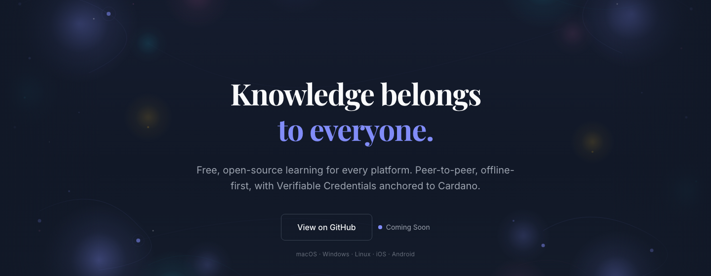

# Alexandria



<p align="center">
  
  
  
</p>

**Decentralized learning platform — desktop and mobile node.**

<p>
  <a href="docs/architecture.md">Architecture</a> &middot;
  <a href="docs/database-schema.md">Database Schema</a> &middot;
  <a href="docs/protocol-specification.md">Protocol Specification</a> &middot;
  <a href="docs/project-structure.md">Project Structure</a> &middot;
  <a href="docs/skills-and-reputation.md">Skills & Reputation</a> &middot;
  <a href="docs/sentinel.md">Sentinel</a> &middot;
  <a href="docs/plugins.md">Plugins</a> &middot;
  <a href="CHANGELOG.md">Changelog</a>
</p>

> **This software is in active development. It is NOT production-ready. Do not use with real credentials, real funds, or sensitive data.**

## What Alexandria Does

- **Courses & Assessments** — Rich HTML, video, and interactive quiz content with per-element progress tracking, notes, and skill tagging.
- **Public Content Availability** — Published course media can resolve from public URLs (with local BLAKE3 caching), and fresh installs bootstrap a bundled public catalog before network discovery catches up.
- **Verifiable Credentials** — Learners earn W3C Verifiable Credentials scoped to individual skills at Bloom's taxonomy levels (remember through create). Credentials are auto-earned: a Cardano completion validator witnesses the learner's element-completion tx, and a local observer auto-issues a self-signed VC referencing that on-chain witness. See [`docs/vc-migration.md`](docs/vc-migration.md) for the current architectural state.
- **Reputation** — Instructor impact derived from learner outcomes, scoped to `(subject, role, skill, proficiency_level)`. Distribution-based with confidence bounds — no global scores.
- **Usernames & Public Profiles** — decentralized @handles backed by a DHT registry (relay-receipted, optionally Cardano-anchored under metadata label 1698), public/private profiles and skill graphs fetched over P2P, and learning targets with computed paths. See [docs/username-registry.md](docs/username-registry.md).
- **Cardano's role** — (1) VC integrity anchoring (BLAKE3-of-VC metadata txs), (2) DAO governance (elections, proposals, reputation snapshots, CIP-68 soulbound reputation tokens), (3) the `completion.ak` validator that witnesses learner completion events to authorize VC issuance, and (4) the `challenge_escrow.ak` validator that holds a challenger's stake pending the DAO's revoke/refund decision. All validators are deployed as reference scripts on **preprod testnet** (block 4736927). Legacy skill-proof / course-registration NFT minting has been retired.
- **Governance** — DAOs mirror the knowledge taxonomy. Elections, proposals, committee-gated taxonomy updates, and P2P propagation are implemented locally. The Aiken/Plutus governance validators are deployed as reference scripts on **preprod testnet** (block 4736927); the on-chain enforcement flows that reference them are still maturing.
- **Assessment Integrity** — Sentinel anti-cheat uses a keystroke autoencoder, mouse trajectory CNN, and face embedder. All processing stays client-side; snapshots are stored locally and feed downstream trust decisions without exposing raw biometrics.
- **Peer-to-Peer** — Fully decentralized via libp2p with a private Alexandria Kademlia DHT, GossipSub, Circuit Relay v2, AutoNAT, and DCUtR. Devices discover each other through a relay bootstrap node — no central server required.
- **Offline-First** — Local SQLite database, iroh content store, and encrypted vault (Stronghold on desktop, AES-256-GCM + Argon2id on mobile). Everything works without connectivity.
- **Multi-User on One Device** — A single device can host any number of fully-isolated learner profiles. Each profile owns its own vault, SQLCipher database, iroh blob cache, and libp2p peer id; switching profiles tears all per-profile services down and brings the next one online. Designed for households, classrooms, and shared-device contexts in regions where personal hardware isn't a given. See [`docs/multi-user-profiles.md`](docs/multi-user-profiles.md).
- **Cross-Device Synced Settings** — Every user preference (theme, sidebar layout, keyboard shortcuts, Sentinel toggles, notifications, ...) lives in one per-profile store and propagates to the user's other devices via peer-to-peer sync. Device-local settings (window geometry, disk quota) stay where they belong. See [`docs/settings.md`](docs/settings.md).
- **Mobile Node** — iOS and Android are first-class targets. The mobile app is a fully functional node — same P2P networking, content storage, and wallet as desktop. Multi-device support via shared BIP-39 mnemonic.

## Architecture

Alexandria is a **Tauri v2 application** — a single binary that bundles a Rust backend with a Vue 3 frontend. It runs on macOS, Linux, Windows, iOS, and Android. There are no servers, no Docker containers, and no external databases.

```
alexandria/
├── src-tauri/        # Rust backend (Tauri v2)
│   └── src/
│       ├── aggregation/ # Deterministic aggregation engine with anti-gaming penalties, weights, independence
│       ├── cardano/  # Blockfrost client, Conway tx building, NFT policies, metadata anchoring
│       ├── classroom/ # Encrypted group messaging, membership, gossip
│       ├── commands/ # IPC command handlers across ~32 modules (frontend ↔ backend), including profile/* lifecycle
│       ├── crypto/   # BIP-39 wallet, per-profile vault (Stronghold / portable), Ed25519, did:key
│       ├── db/       # SQLite (~75 tables, 56 migrations, seed data) — one DB per profile
│       ├── diag.rs   # File-based diagnostic logger + panic hook
│       ├── domain/   # Business logic (courses, tutorials, opinions, vc, evidence, governance, ...)
│       ├── evidence/ # Proficiency taxonomy + thresholds (reputation/attestation/challenge disabled post-VC-first cutover)
│       ├── ipfs/     # iroh node, BLAKE3 content-addressed blobs, CID resolution
│       ├── p2p/      # libp2p swarm — DHT, relay, gossip, peer exchange, vc-fetch, graph-fetch, profile-fetch, username-reg
│       ├── profile/  # Multi-user profile manager + public profiles_index.json sidecar + auto-migrator
│       ├── settings/ # Unified per-profile settings: typed registry + sync/device-scoped store
│       └── tutoring/ # Live audio/video tutoring (desktop + mobile managers)
├── src/              # Vue 3 + TypeScript frontend
│   ├── pages/        # Route views (ProfileSelect, Onboarding, courses, skills, governance, opinions, tutoring, ...)
│   ├── components/   # UI components + auth + course + layout + profile (picker tiles + avatar)
│   ├── composables/  # useProfiles (canonical), useSettings (per-profile prefs + cross-device sync), useAuth (compat shim), useTheme, useP2P, useSentinel, useLocalApi, useBiometricVault, useClassroom, useContentSync, useCredentials, useOmniSearch, usePlatform, useSkillGraphState, useSkillGraphHover, useTutoringRoom
│   └── assets/       # Tailwind CSS v4 design system
├── cli/              # Developer CLI (alex) — Rust + clap
├── patches/          # Local crate patches (if-watch iOS fix)
└── docs/             # Architecture, schema, protocol, structure docs
```

| Layer | Technology |
|-------|------------|
| Shell | Tauri 2.10, WebKit (macOS/iOS) / WebView2 (Windows) / Android WebView (Chromium) |
| Backend | Rust (2021 edition), tokio async runtime |
| Frontend | Vue 3, TypeScript, Vite, Tailwind CSS 4 |
| Database | SQLite + SQLCipher (rusqlite, bundled-sqlcipher) |
| Content storage | iroh 0.96 (BLAKE3 content-addressed blobs) |
| P2P networking | libp2p 0.56 (TCP, QUIC, GossipSub, Kademlia, Relay, DCUtR) |
| Wallet (desktop) | BIP-39 + CIP-1852 (pallas), per-profile IOTA Stronghold vault |
| Wallet (mobile) | BIP-39 + CIP-1852 (pallas), per-profile AES-256-GCM + Argon2id vault |
| Cardano | pallas 0.35 (Conway tx builder), Blockfrost preprod |
| Developer CLI | Rust, clap 4, owo-colors |

For the full architecture breakdown, see [Architecture](docs/architecture.md).

## P2P Network

All nodes connect to a private Alexandria Kademlia DHT (`/alexandria/kad/1.0`) using a relay server as the bootstrap node. The relay provides:

- **Circuit Relay v2** — NAT traversal for mobile and firewalled nodes
- **Kademlia DHT** — Peer discovery via `get_providers` on the namespace key `SHA256("ifftu.alexandria")`
- **Identify** — Protocol negotiation and agent version exchange

After connecting to the relay, each node:

1. Requests a circuit relay reservation (reachable address for NAT'd peers)
2. Bootstraps the Kademlia DHT
3. Registers as a provider on the namespace key
4. Discovers other providers and dials them directly (or via relay hop)

Known peer addresses are persisted to a `peers` table in SQLite and reloaded on subsequent launches. GossipSub peer exchange messages propagate addresses across the mesh.

The P2P node auto-starts after the active profile is unlocked. Each device gets its own libp2p peer id — derived per-device via `HKDF(payment_key, device_id)` — so the same mnemonic restored onto a second device appears as a separate peer. Home also attempts a content sync (bootstrap + hydrate) after unlock and surfaces completion stats in the bottom status bar.

The relay server lives in a [separate repository](https://github.com/ifftu-dev/alexandria-relay). Fresh peer discovery still depends on these hardcoded Alexandria relay nodes today; locally-held credentials and content survive the relay infrastructure disappearing, but bootstrapping new peers into the mesh would not — DNS seeds and user-pinned bootstrap lists are on the post-launch roadmap.

## Getting Started

### Prerequisites

- **Rust 1.89+** with `cargo`
- **Node.js 22+** with `npm`
- **Tauri CLI**: `cargo install tauri-cli`

For fresh desktop builds with full audio-video live tutoring:

- **macOS**: `brew install cmake ffmpeg libtool automake autoconf`
- **Linux**: `sudo apt-get install -y cmake libwebkit2gtk-4.1-dev libappindicator3-dev librsvg2-dev patchelf nasm libclang-dev pkg-config libopus-dev libssl-dev libx264-dev libva-dev libgbm-dev libdrm-dev libvdpau-dev`
- **Windows**: install CMake, install MSYS2 autotools (`pacman -S --noconfirm libtool automake autoconf`), download a shared FFmpeg build, set `FFMPEG_DIR`, and add `FFMPEG_DIR\\bin` to `PATH`

Desktop builds use `tutoring-video` on macOS/Windows and `tutoring-video-static` on Linux. iOS builds use `tutoring-video-ios`. Android builds can opt into the shared video pipeline with `tutoring-video-android`.

For iOS builds:

- **Xcode 15+** with command-line tools
- **Rust iOS targets**: `rustup target add aarch64-apple-ios aarch64-apple-ios-sim`
- **Apple Development Team** configured in `src-tauri/tauri.conf.json`

For Android builds:

- **Android Studio** with SDK, NDK 26+, and Build Tools 34+
- **Rust Android targets**: `rustup target add aarch64-linux-android armv7-linux-androideabi i686-linux-android x86_64-linux-android`
- **Environment variables**: `ANDROID_HOME`, `NDK_HOME`, `JAVA_HOME` (pointing to Android Studio's bundled JDK)

### Cardano (Optional)

For on-chain features (NFT wrappers, governance transactions, soulbound/reputation flows):

- **Blockfrost API key**: Sign up at [blockfrost.io](https://blockfrost.io), create a preprod project. Two ways to configure it:
  - **In-app (recommended)**: Settings → Cardano → "Blockfrost project id". Stored per-device, picked up at runtime without restart.
  - **Env var (CI / dev scripts)**:
    ```bash
    export BLOCKFROST_PROJECT_ID="preprodXXX..."
    ```
  The in-app setting takes precedence over the env var.
- **Testnet ADA**: Fund your wallet address from the [Cardano Faucet](https://docs.cardano.org/cardano-testnets/tools/faucet/) (minimum 5 tADA for wrapper/NFT minting, ~40 tADA for deploying governance validators)
- **Aiken** (for smart contract development): Install from [aiken-lang.org](https://aiken-lang.org/installation-instructions) v1.1.21+

Without either source set, the app works fully offline — blockchain features are simply unavailable.

### Development (Desktop)

```bash
git clone git@github.com:ifftu-dev/alexandria.git
cd alexandria
npm install
cargo tauri dev
```

The app launches a native window backed by a local webview. First launch generates the SQLite database, runs migrations, seeds taxonomy/courses/governance data, and starts the iroh content store.

### Building for iOS

**Simulator (Apple Silicon):**

```bash
cargo tauri ios build --target aarch64-sim
```

**Physical device:**

```bash
cargo tauri ios build --target aarch64
```

**Deploy to simulator:**

```bash
xcrun simctl install <SIMULATOR_UDID> src-tauri/gen/apple/build/arm64-sim/Alexandria.app
xcrun simctl launch <SIMULATOR_UDID> org.alexandria.node
```

**Deploy to device:**

```bash
xcrun devicectl device install app --device <DEVICE_UDID> src-tauri/gen/apple/build/arm64/Alexandria.ipa
xcrun devicectl device process launch --device <DEVICE_UDID> org.alexandria.node
```

Clean build artifacts before rebuilding to avoid "Directory not empty" errors:

```bash
rm -rf src-tauri/gen/apple/build
```

### Building for Android

**Debug APK (for emulator or sideloading):**

```bash
cargo tauri android build --debug --target aarch64
```

**Release APK (unsigned — requires signing for distribution):**

```bash
cargo tauri android build --target aarch64
```

**Deploy to emulator:**

```bash
adb install src-tauri/gen/android/app/build/outputs/apk/universal/debug/app-universal-debug.apk
adb shell am start -n org.alexandria.node/.MainActivity
```

Clean build artifacts:

```bash
rm -rf src-tauri/gen/android/app/build
```

> **Note:** Android safe area insets (`env(safe-area-inset-*)`) are not natively supported by Android WebView. `MainActivity.kt` reads actual `WindowInsets` and injects them as CSS custom properties (`--sat`, `--sab`, `--sal`, `--sar`).

### Developer CLI (`alex`)

The `alex` CLI wraps common dev tasks, multi-platform builds, and data management into a single tool.

```bash
cargo install --path cli    # install globally as `alex`
```

#### Running

```bash
# Desktop (hot-reload dev server)
alex run desktop                              # cargo tauri dev

# iOS (interactive device/simulator picker)
alex run ios                                  # pick from available simulators + devices
alex run ios --device "iPhone 17 Pro"         # skip picker, run on specific device
alex run ios --open                           # open in Xcode instead

# Android (interactive emulator/device picker)
alex run android                              # pick from available AVDs + devices
alex run android --device "Pixel_9_Pro"       # skip picker, run on specific emulator
alex run android --open                       # open in Android Studio instead

# All run commands support --release for release mode
alex run ios --release
```

#### Code Quality

```bash
alex dev test         # cargo test with host tutoring media feature
alex dev clippy       # cargo clippy with host tutoring media feature
alex dev fmt          # cargo fmt --check
alex dev check        # vue-tsc type check
alex dev all          # fmt + clippy + test + check (full CI pass)
```

`alex dev test`, `alex dev clippy`, and `alex build check` automatically enable the host tutoring media feature:
- macOS / Windows: `tutoring-video`
- Linux: `tutoring-video-static`

#### Building

```bash
# Quick builds
alex build check      # cargo check + vue-tsc with host tutoring feature
alex build release    # Full desktop release (cargo tauri build + host tutoring feature)

# Platform-specific builds
alex build desktop                        # Current host (e.g. mac-arm64)
alex build desktop --target mac-arm64 mac-x64   # Multiple targets
alex build android                        # arm64 (default)
alex build android --target arm64 armv7   # Multiple Android ABIs
alex build ios                            # Simulator for current arch
alex build ios --target device            # iOS device (needs signing)
alex build ios --target device sim-arm64  # Device + simulator

# All platforms at once (uses host defaults for each)
alex build all
alex build all --debug

# Debug builds (faster compile, larger binary)
alex build desktop --debug
alex build android --debug
alex build ios --debug

# Interactive wizard (prompts for platform, targets, profile)
alex build platform

# List all available build targets
alex build list
```

**Available build targets:**

| Platform | Target | Description | Rust triple |
|----------|--------|-------------|-------------|
| Desktop | `mac-arm64` | macOS Apple Silicon | `aarch64-apple-darwin` |
| Desktop | `mac-x64` | macOS Intel | `x86_64-apple-darwin` |
| Desktop | `mac-universal` | macOS Universal | `universal-apple-darwin` |
| Desktop | `linux-x64` | Linux x86_64 | `x86_64-unknown-linux-gnu` |
| Desktop | `win-x64` | Windows x86_64 | `x86_64-pc-windows-msvc` |
| Android | `arm64` | arm64-v8a | `aarch64-linux-android` |
| Android | `armv7` | armeabi-v7a | `armv7-linux-androideabi` |
| Android | `x86_64` | x86_64 (emulator) | `x86_64-linux-android` |
| iOS | `device` | iOS device | `aarch64-apple-ios` |
| iOS | `sim-arm64` | Simulator (ARM) | `aarch64-apple-ios-sim` |
| iOS | `sim-x64` | Simulator (Intel) | `x86_64-apple-ios` |

Prerequisites are checked automatically before each build. Android requires `ANDROID_HOME`, NDK, and Java 21. iOS requires Xcode. Device builds require code signing.

#### Database & Data

The CLI operates on the same SQLCipher-encrypted database as the app. Commands that access the database prompt for the active profile's password.

```bash
alex db status        # Table row counts, migration version, data sizes (active profile)
alex db migrate       # Run pending schema migrations on the active profile DB
alex db seed          # Seed demo data (taxonomy, courses, governance) into the active profile
alex db seed --force  # Clear and re-seed the active profile
alex db reset --force # Delete ALL app data on this device (every profile + sidecar index)
```

> **Note**: Each profile's database is encrypted with a key derived from that profile's vault password (Argon2id + HKDF-SHA256). The app must have been launched at least once to create the profile (via onboarding) before CLI database commands will work. `alex db reset --force` is destructive across every profile on the device — use the picker's per-profile delete to remove a single user instead.

#### Configuration

```bash
alex config show      # Project paths, Tauri config, tool versions
alex config path      # Print app data directory (for scripting)
```

#### Health & Cleanup

```bash
alex health           # Check if the app process is running

alex clean build      # Remove target/, dist/, .vite cache
alex clean data --force  # Remove app data
alex clean all --force   # Remove everything
```

### First-Time Onboarding

1. Launch the app — you see the onboarding screen
2. Pick a profile name (shown later on the picker — renameable)
3. Create a password — this encrypts that profile's vault
4. A 24-word BIP-39 mnemonic is generated (CIP-1852 derivation)
5. Payment and stake addresses are derived (preprod testnet)
6. Back up the mnemonic — it is the identity and wallet for *this profile*
7. The P2P node starts automatically and connects to the network

Subsequent launches land on the **profile picker** (`/profiles`) — an avatar grid of every profile on the device. Pick one, enter its password, and you're in.

### Switching users

- **From the avatar dropdown** in the top right: **Switch user** locks the current profile and returns to the picker.
- **Keyboard shortcut**: `Cmd/Ctrl + Shift + U` from anywhere.
- **Add another profile** from the picker's **Add user** tile — runs onboarding again with a fresh name + password.

Each profile is fully isolated: its own vault, SQLCipher database, iroh blob cache, plugin directory, and libp2p peer id. Switching tears all per-profile services down and brings the next one online — any in-flight tutoring session is ended.

To use the same identity on another device, restore the mnemonic into a new profile on that device.

To reset and start fresh:

```bash
alex db reset --force   # Or manually: rm -rf ~/Library/Application\ Support/org.alexandria.node/
```

> **Upgrading from a single-vault install?** The first launch after upgrade auto-migrates the legacy `stronghold/`, `iroh/`, `plugins/`, and `videocache/` directories into a new `profiles/<uuid>/` slot named "My Profile". Rename and add avatars from the picker afterwards.
>
> ⚠ **Encrypted databases only:** this build refuses to open an unencrypted legacy `alexandria.db`. If your install ever ran in plaintext mode, move that file aside (or delete it) and re-run onboarding before launching — the app will surface an explicit error rather than touch it. The earlier "no data loss" auto-conversion path was removed because it overwrote the legacy file instead of converting it.

## Testing

```bash
# Full desktop tutoring test surface
cargo test -p alexandria-node --features tutoring-video        # macOS / Windows
cargo test -p alexandria-node --features tutoring-video-static # Linux

# Individual module tests
cargo test -p alexandria-node --features tutoring-video wallet        # macOS / Windows
cargo test -p alexandria-node --features tutoring-video-static wallet # Linux
cargo test -p alexandria-node --features tutoring-video p2p           # macOS / Windows
cargo test -p alexandria-node --features tutoring-video evidence      # macOS / Windows
cargo test -p alexandria-node --features tutoring-video-static p2p    # Linux
cargo test -p alexandria-node --features tutoring-video-static evidence # Linux

# iOS simulator compile check (full mobile A/V tutoring path)
cargo check -p alexandria-node --target aarch64-apple-ios-sim --features tutoring-video-ios

# Frontend type check
npx vue-tsc -b
```

The test suite includes:
- **700+ synchronous tests** across crypto, database, P2P, evidence, cardano, credentials, aggregation, governance, and domain modules (run `cargo test -p alexandria-node --lib` for the exact current count)
- **30+ async tests** (tokio) for iroh content operations, P2P swarm lifecycle, and network integration
- **~1500 lines of stress tests** covering high-volume gossip (200+ messages), concurrent validation (1000 messages / 10 threads), sync conflicts, and adversarial inputs
- **Frontend Vitest suite** — first wave of composable tests (e.g. `useOmniSearch`), expanding

## Data Storage

All data lives in `~/Library/Application Support/org.alexandria.node/` (macOS). The layout is **per-profile** — each user owns an isolated tree.

| File/Directory | Purpose |
|----------------|---------|
| `profiles_index.json` | Public sidecar — display names, avatars, colors, timestamps. Read by the picker before any vault is unlocked. **No keys, DIDs, or stake addresses.** |
| `profiles/<uuid>/vault/` | Per-profile encrypted vault (Stronghold on desktop, AES-256-GCM + Argon2id on mobile) |
| `profiles/<uuid>/alexandria.db` | Per-profile SQLCipher database (~73 tables), key derived from that profile's password |
| `profiles/<uuid>/iroh/` | Per-profile content-addressed blob store (course content, user profiles) and node secret |
| `profiles/<uuid>/plugins/` | Per-profile installed plugin bundles |
| `profiles/<uuid>/videocache/` | Per-profile materialized video files (served via Tauri's asset protocol) |

On first launch after upgrading from a single-vault install, the legacy top-level files (`alexandria.db`, `stronghold/` or `vault/`, `iroh/`, `plugins/`, `videocache/`) are atomically moved into a fresh `profiles/<uuid>/` slot.

Use `alex config path` to print this directory on any platform.

## Documentation

| Document | Description |
|----------|-------------|
| [Architecture](docs/architecture.md) | System design — offline-first, trustless, multi-platform |
| [Multi-User Profiles](docs/multi-user-profiles.md) | Per-profile vault + DB + iroh isolation, picker UX, auto-migration |
| [Settings](docs/settings.md) | Unified per-profile settings store + cross-device sync + how to add a new setting |
| [Database Schema](docs/database-schema.md) | All tables + per-profile DB layout |
| [Protocol Specification](docs/protocol-specification.md) | Wire formats, VC protocol, 13 gossip topics, validation, peer scoring |
| [Stake-Pubkey Registry](docs/stake-pubkey-registry.md) | Persistent stake-address ↔ gossip pubkey registry that backs privileged-topic authority (replaces in-memory TOFU) |
| [Stake-Pubkey Runbook](docs/stake-pubkey-registry-runbook.md) | Operational steps: founder keypair ceremony + multisig signing of `bootstrap_registry.json` + preprod smoke test |
| [Project Structure](docs/project-structure.md) | Directory layouts, module responsibilities |
| [Skills & Reputation](docs/skills-and-reputation.md) | Skill graph, evidence model, reputation system |
| [Username Registry](docs/username-registry.md) | Decentralized @handles: DHT claims, relay receipts, Cardano anchoring |
| [Sentinel](docs/sentinel.md) | Assessment integrity — behavioral fingerprinting, ML models |
| [Security Audit](docs/security-audit.md) | 32 findings (1 critical, 7 high, 10 medium, 9 low, 5 informational) |
| [Performance Audit](docs/performance-audit.md) | 23 findings (2 critical, 5 high, 8 medium, 5 low, 3 informational) |

## License

This repo is available under the [MIT expat license](LICENSE.md), except for the ee directories (which have their own licenses) if and as applicable.
