# Database Schema

> Alexandria — SQLite (local-first)

> **⚠️ Post-VC-first cutover (migration 040, 2026-04-24):** The
> following tables are **dropped** and should be treated as absent
> when cross-referencing this document:
> `skill_proofs`, `skill_proof_evidence`, `evidence_records`,
> `skill_assessments`, `reputation_evidence`,
> `reputation_impact_deltas`, `evidence_challenges`,
> `challenge_votes`, `attestation_requirements`,
> `evidence_attestations`.
> The `credentials` table gains four columns:
> `witness_tx_hash`, `witness_validator_script_hash`,
> `witness_validator_name`, `auto_issued`. See
> [`vc-migration.md`](./vc-migration.md) for the full diff.

**Engine**: SQLite (rusqlite 0.38, bundled)
**Migrations**: 51

---

## Table of Contents

1. [Design Principles](#design-principles)
2. [Migration History](#migration-history)
3. [Tables by Domain](#tables-by-domain)
4. [Entity Relationship Summary](#entity-relationship-summary)

---

## Design Principles

- **Deterministic IDs**: Most application entities use `hex(blake2b_256(parts.join("|")))` instead of server-generated UUIDs.
- **Singleton identity per profile**: `local_identity` is a one-row table with `CHECK (id = 1)`. Each user profile has its own SQLCipher database (see [`multi-user-profiles.md`](multi-user-profiles.md)), so "singleton" is scoped per-profile, not per-device — a device with three profiles has three independent `local_identity` rows, each in its own encrypted DB file.
- **No server tables**: No hosted auth/session model exists; the app is profile-based and local-first.
- **External content**: Course content, published profiles, evidence bundles, and other large artifacts live in iroh/IPFS-addressed blobs. SQLite stores metadata, references, and caches.
- **Text timestamps**: Time values are stored as ISO-8601-ish `TEXT` for portability and easy inspection.
- **Canonical source**: The exact DDL, defaults, `CHECK` constraints, indexes, and migration bodies live in `src-tauri/src/db/schema.rs`.

---

## Migration History

| Version | Name | Description |
|---------|------|-------------|
| 1 | `initial_schema` | Core tables: identity, taxonomy, courses, learning, evidence, integrity, P2P, governance |
| 2 | `profile_hash` | Add `profile_hash` to `local_identity` |
| 3 | `content_mappings` | Bidirectional CID↔BLAKE3 mapping for the iroh/IPFS bridge |
| 4 | `assessment_columns` | Add `weight` and `source_element_id` to `skill_assessments` |
| 5 | `governance_members` | DAO committee membership |
| 6 | `reputation_engine` | Reputation evidence and impact-delta tables |
| 7 | `governance_elections` | Elections, nominees, proposal voting, election voting |
| 8 | `reputation_snapshots` | On-chain reputation snapshot records |
| 9 | `taxonomy_ratification` | Add `ratified_by` and `ratified_at` to `taxonomy_versions` |
| 10 | `cross_device_sync` | Devices, sync state, sync queue, local device metadata |
| 11 | `evidence_challenges` | Challenge and challenge-vote tables |
| 12 | `multi_party_attestation` | Attestation requirements and attestation records |
| 13 | `visual_assets` | Add display/image fields such as `author_name`, `thumbnail_svg`, and `icon_emoji` |
| 14 | `inline_content` | Add `content_inline` to `course_elements` |
| 15 | `tutoring_sessions` | Live tutoring session metadata |
| 16 | `classrooms` | Classrooms, members, join requests, channels, messages, calls |
| 17 | `storage_settings` | Persistent app settings (`app_settings`) |
| 18 | `onchain_governance_queue` | Async governance submission queue |
| 19 | `classroom_encryption` | Classroom group keys plus X25519 key material |
| 20 | `tutorials_and_video_chapters` | Course/tutorial discriminator and per-video chapter markers |
| 21 | `opinions` | Field Commentary opinions, pending verification, DAO withdrawals |
| 22 | `vc_key_registry` | Historical DID key registry for VC verification |
| 23 | `vc_credentials_and_status_lists` | Canonical VC store and status-list bitmaps |
| 24 | `vc_credential_anchors` | Cardano integrity-anchor queue for credential hashes |
| 25 | `vc_pinboard_observations` | PinBoard commitment observations |
| 26 | `vc_presentations_seen` | Replay-protection log for selective-disclosure presentations |
| 27 | `vc_derived_skill_states` | Cached aggregation outputs |
| 28 | `vc_credentials_pending_verification` | Queue for inbound credentials awaiting issuer DID resolution |
| 29 | `vc_credential_suspension` | Add credential suspension metadata and supersession index |
| 30 | `vc_credential_allowlist` | Subject-controlled allowlist for `/alexandria/vc-fetch/1.0` |
| … | (migrations 31-39: content provenance, plugin system, plugin catalog/attestations, sentinel flags/priors/holdout) | |
| 40 | `vc_first_cutover` | Hard cut to VC-first. Drops the SkillProof/evidence pipeline (`skill_proofs`, `skill_proof_evidence`, `evidence_records`, `skill_assessments`, `reputation_evidence`, `reputation_impact_deltas`, `evidence_challenges`, `challenge_votes`, `attestation_requirements`, `evidence_attestations`). Adds witness columns to `credentials`. |
| 41 | `completion_observer` | `completion_observations` — observer memo for Cardano completion-mint events that auto-issue VCs |
| 42 | `completion_attestation` | `completion_attestation_requirements` + `completion_attestations` — VC-first replacement for evidence cosigning |
| 43 | `credential_challenges` | `credential_challenges` + `credential_challenge_votes` — VC-first replacement for evidence challenges |
| 44 | `integrity_paste_anomaly` | Add `ai_paste_anomaly` column to `integrity_snapshots` |
| 45 | `sentinel_priors_model_weights` | Add DAO-ratified model-weights columns (`weights_cid`, `eval_cid`, `eval_tpr`, `eval_fpr`, `version`) to `sentinel_priors` |
| 46 | `sentinel_kill_switch_and_blocklist` | `sentinel_kill_switch` + `sentinel_weights_blocklist` — operator safety valves for the paste classifier |
| 47 | `sentinel_user_models` | `sentinel_user_models` — per-user keystroke/mouse weights moved from browser localStorage into the encrypted DB |
| 48 | `app_settings_scope` | Add `scope` column (`sync` / `device`) to `app_settings`. Reclassifies `storage_quota_bytes` as `device`-scoped. Powers the unified per-profile settings store; see [`settings.md`](settings.md). |
| 49 | `device_pairing` | Add `stake_address` / `shared_key` / `paired` to `devices`; new `pending_pairings` table for explicit device pairing |
| 50 | `challenge_stake_lifecycle` | Add `stake_status` + `settle_tx_hash` to `credential_challenges` for stake-escrow settlement |
| 51 | `element_submission_grader_version` | Add `grader_version` column to `element_submissions` |

---

## Tables by Domain

This section is a domain summary, not a copy of the full DDL. For exact
columns and indexes, use `src-tauri/src/db/schema.rs`.

### Identity

- **`local_identity`** — Singleton row for the *active profile's* owner.
  Each profile's SQLCipher DB has exactly one row at `id = 1`. Stores
  wallet/profile metadata such as `stake_address`, `payment_address`,
  `display_name`, `bio`, `avatar_cid`, `profile_hash`, encrypted
  mnemonic fallback, device metadata, and X25519 public key material.
  The public-facing profile picker metadata (name shown on the
  picker, avatar, accent color) lives separately in the unencrypted
  `profiles_index.json` sidecar — see
  [`multi-user-profiles.md`](multi-user-profiles.md).

### Taxonomy (6 tables)

- **`subject_fields`** — Top-level domains, including optional `icon_emoji`.
- **`subjects`** — Child subjects linked to a `subject_field_id`.
- **`skills`** — Skill records tied to a subject and Bloom level.
- **`skill_prerequisites`** — Directed prerequisite edges.
- **`skill_relations`** — Non-prerequisite skill relationships.
- **`taxonomy_versions`** — Signed taxonomy version history with `cid`,
  `previous_cid`, `ratified_by`, `ratified_at`, `signature`, and `applied_at`.

### Courses and Learning (10 tables)

- **`courses`** — Course/tutorial metadata. Important fields include
  `title`, `description`, `author_address`, `author_name`, `content_cid`,
  `thumbnail_cid`, `thumbnail_svg`, `tags`, `skill_ids`, `kind`,
  `version`, `status`, `published_at`, and `on_chain_tx`.
- **`course_chapters`** — Ordered chapter rows per course.
- **`course_elements`** — Element rows with `title`, `element_type`,
  `content_cid`, optional `content_inline`, `position`, and `duration_seconds`.
- **`element_skill_tags`** — Element-to-skill mapping with `weight`.
- **`video_chapters`** — Timestamp markers for video elements.
- **`enrollments`** — Enrollment rows with `course_id`, `enrolled_at`,
  `completed_at`, `status`, and `updated_at`.
- **`element_progress`** — Per-element progress with `status`, `score`,
  `time_spent`, `completed_at`, and `updated_at`.
- **`course_notes`** — Notes scoped to an enrollment/chapter/element,
  with `content_cid`, `preview_text`, and `video_timestamp_seconds`.
- **`element_submissions`** — Plugin-graded element submissions, keyed
  to an `element_id`/`enrollment_id`, with `submission_cid`,
  `grader_cid`, `content_cid`, `score`, `score_details_json`,
  `learner_did`, an optional `signed_attestation`, and the grader's
  self-declared `grader_version` (migration 051; folded into the
  completion Merkle leaf so the on-chain witness is reproducible).
- **`catalog`** — Network-discovered course metadata mirroring the
  publishable subset of `courses`.

### Reputation (2 tables)

> The SkillProof/evidence pipeline (`skill_assessments`,
> `evidence_records`, `skill_proofs`, `skill_proof_evidence`,
> `reputation_evidence`, `reputation_impact_deltas`) was dropped in
> migration 040. Reputation now derives directly from the
> `credentials` VC store.

- **`reputation_assertions`** — Reputation rows keyed by
  `actor_address`/`role`/`skill_id`/`proficiency_level` and a
  `window_start`/`window_end`, with `score`, `evidence_count`,
  `computation_spec`, `cid`, and distribution metrics computed over
  the actor's credentials: `median_impact`, `impact_p25`,
  `impact_p75`, `learner_count`, and `impact_variance`.
- **`reputation_snapshots`** — Snapshot/anchoring records for
  reputation assertions, keyed by actor with `tx_status` and subject.

### Integrity (Sentinel) (6 tables)

- **`integrity_sessions`** — Sentinel sessions tied to an `enrollment_id`,
  with `status`, `integrity_score`, `started_at`, and `ended_at`.
- **`integrity_snapshots`** — Snapshot rows keyed by `session_id`, with
  per-signal scores (`typing_score`, `mouse_score`, `human_score`,
  `tab_score`, `paste_score`, `devtools_score`, `camera_score`),
  `composite_score`, `captured_at`, and the ONNX paste/typing-bot
  classifier output `ai_paste_anomaly` (nullable; NULL for snapshots
  taken before the model artifact ships).
- **`sentinel_priors`** — DAO-ratified training samples and model
  weights for the paste classifier. Weights rows carry `weights_cid`,
  `eval_cid`, `eval_tpr`, `eval_fpr`, and `version`; a client only
  auto-loads a weights row whose gate passes (`eval_tpr >= 0.92 AND
  eval_fpr <= 0.03`).
- **`sentinel_kill_switch`** — Single row per `model_kind`; when
  `active = 1` the client treats that classifier as disabled even if a
  ratified row exists.
- **`sentinel_weights_blocklist`** — `(model_kind, version)` pairs the
  active-classifier selector must skip, for rolling back a faulty
  ratified model without amending governance history.
- **`sentinel_user_models`** — Per-user keystroke autoencoder
  (`keystroke_ae`) and mouse CNN (`mouse_cnn`) weights, keyed by
  `(user_address, device_fp_prefix, model_kind)`. Moved out of browser
  localStorage into the encrypted DB.

### P2P, Content, and Sync Support (8 tables)

- **`peers`** — Known libp2p peers with `addresses`, `roles`, and local `reputation`.
- **`pins`** — Local iroh pin state, including `size_bytes`,
  `last_accessed`, `auto_unpin`, and `pinned_at`.
- **`sync_log`** — Broadcast/receive audit trail for gossip-synced entities.
- **`content_mappings`** — IPFS CID ↔ iroh BLAKE3 bridge table.
- **`devices`** — Known devices for cross-device sync (`id`, `device_name`,
  `platform`, `peer_id`, `is_local`, timestamps). Explicit pairing
  (migration 049) adds `stake_address` (sync only proceeds when it
  matches the local identity), `shared_key` (per-pair AES-256-GCM key,
  NULL until paired), and `paired` (1 once the two-way handshake
  completed).
- **`pending_pairings`** — Short-lived pairing codes generated by this
  device and awaiting acceptance, keyed by `code_hash` with a
  `shared_key` and `expires_at`.
- **`sync_state`** — Per-device per-table watermarks plus `row_count`.
- **`sync_queue`** — Outbound row-change queue with `row_data`,
  `updated_at`, `queued_at`, and `delivered_to`.

### Governance (7 tables + 1 queue)

- **`governance_daos`** — DAO metadata scoped by `scope_type` and `scope_id`.
- **`governance_proposals`** — Proposal lifecycle rows with category,
  vote tallies, and optional `on_chain_tx`.
- **`governance_dao_members`** — DAO committee membership.
- **`governance_elections`** — Election cycles keyed by `phase`,
  proficiency gates, timing windows, and `on_chain_tx`.
- **`governance_election_nominees`** — Election nominees and results.
- **`governance_election_votes`** — Individual election votes.
- **`governance_proposal_votes`** — Individual proposal votes.
- **`onchain_governance_queue`** — Persistent queue for async governance
  submissions, with `attempts`, `last_error`, and status transitions.

### Challenges, Attestations, and Opinions (7 tables)

> The evidence-based challenge/attestation tables (`evidence_challenges`,
> `challenge_votes`, `attestation_requirements`, `evidence_attestations`)
> were dropped in migration 040 and rebuilt against the `credentials`
> VC store in migrations 042–043.

- **`completion_attestation_requirements`** — Per-course gate (keyed by
  `course_id`) for how many attestor signatures a learner's
  completion-witness tx needs before the observer auto-issues a VC, with
  `required_attestors`, `dao_id`, and optional `set_by_proposal`.
- **`completion_attestations`** — Individual attestor signatures over a
  `witness_tx_hash` (`attestor_did`, `attestor_pubkey`, `signature`,
  optional `note`; unique per `(witness_tx_hash, attestor_did)`).
- **`credential_challenges`** — Stake-based challenges against a
  `credential_id`, with `challenger`, `reason`, `stake_lovelace`,
  `stake_tx_hash`, `status` (pending/reviewing/upheld/rejected/expired),
  `dao_id`, `resolution_tx`, `signature`, and the stake-escrow lifecycle
  fields `stake_status` (none/locked/returned/forfeited) and
  `settle_tx_hash` (migration 050).
- **`credential_challenge_votes`** — Committee votes on a `challenge_id`
  (`voter`, `upheld`, optional `reason`; unique per `(challenge_id, voter)`).
- **`opinions`** — Field Commentary video takes scoped to a `subject_field_id`,
  with staked `credential_proof_ids`, signature, publication timestamps,
  and withdrawal state.
- **`opinions_pending_verification`** — Queue for opinions whose referenced
  proofs have not synced locally yet.
- **`opinion_withdrawals`** — DAO-signed withdrawal records.

### Tutoring, Classrooms, and Settings (9 tables)

- **`tutoring_sessions`** — Live tutoring session metadata:
  `title`, `ticket`, `status`, `created_at`, `ended_at`.
- **`classrooms`** — Group-space metadata with `owner_address`,
  `invite_code`, and `status`.
- **`classroom_members`** — Membership rows; migration 19 adds
  `x25519_public_key`.
- **`classroom_join_requests`** — Join request queue with review state.
- **`classroom_channels`** — Text/announcement channels per classroom.
- **`classroom_messages`** — Persisted messages with edit/delete flags.
- **`classroom_calls`** — Live classroom A/V calls backed by iroh-live tickets.
- **`classroom_group_keys`** — Encrypted per-classroom group keys for E2E messaging.
- **`app_settings`** — Unified per-profile settings KV store
  (`key TEXT PRIMARY KEY`, `value TEXT`, `scope TEXT NOT NULL`,
  `updated_at TEXT`). `scope` is one of `'sync'` (replicated across
  the user's other devices via cross-device sync; LWW on
  `updated_at`) or `'device'` (stays on this device only). The
  Rust-side typed registry (`settings::registry::keys`) is the
  source of truth for valid keys + defaults — the table only
  stores values the user has actually changed. See
  [`settings.md`](settings.md) for the architecture and the
  current list of registered settings.

### Verifiable Credentials Layer

These tables back the VC-first protocol described in
`docs/protocol-specification.md`.

- **`key_registry`** — Historical `(did, key_id)` public-key bindings with
  validity windows.
- **`credentials`** — Canonical signed VC store, with searchable mirrors
  for issuer/subject/type/skill plus revocation, suspension, and
  supersession state. Migration 040 adds on-chain witness metadata:
  `witness_tx_hash`, `witness_validator_script_hash`,
  `witness_validator_name`, and `auto_issued` (1 when the credential was
  auto-issued by the completion observer rather than manually).
- **`credential_status_lists`** — Versioned RevocationList2020-style status bitmaps.
- **`credential_anchors`** — Per-credential integrity-anchor queue.
- **`pinboard_observations`** — Local and remote PinBoard commitments.
- **`presentations_seen`** — `(audience, nonce)` replay-protection log.
- **`derived_skill_states`** — Materialized aggregation cache for
  recruiter/consumer queries.
- **`credentials_pending_verification`** — Queue for VCs that arrive
  before the issuer DID document.
- **`credential_allowlist`** — Per-credential fetch policy for
  `/alexandria/vc-fetch/1.0`.
- **`completion_observations`** — The completion observer's persistent
  memo (migration 041). Keyed by `(policy_id, asset_name_hex)`, it
  records each witnessed Cardano completion mint (`tx_hash`,
  `subject_pubkey`, `course_id`, `completion_root`, `completion_time`)
  and the `credential_id` populated once the VC is auto-issued, so the
  observer neither re-issues nor misses mints that occurred while
  offline.
- **Migration 29 additions on `credentials`** — `suspended`,
  `suspended_at`, `suspended_until`, `suspended_reason`, plus an index
  on `supersedes`.

## Entity Relationship Summary

```mermaid
erDiagram
    subject_fields ||--o{ subjects : contains
    subjects ||--o{ skills : contains
    skills ||--o{ skill_prerequisites : "DAG edges"
    skills ||--o{ skill_relations : relates

    courses ||--o{ course_chapters : contains
    course_chapters ||--o{ course_elements : contains
    course_elements ||--o{ element_skill_tags : tagged
    course_elements ||--o{ video_chapters : chapters
    skills ||--o{ element_skill_tags : tagged

    courses ||--o{ enrollments : has
    enrollments ||--o{ element_progress : tracks
    enrollments ||--o{ course_notes : has
    enrollments ||--o{ element_submissions : graded

    credentials ||--o{ credential_challenges : challenged
    credential_challenges ||--o{ credential_challenge_votes : votes
    completion_observations ||--o| credentials : "auto-issues"
    completion_attestation_requirements ||--o{ completion_attestations : "gated by"
    reputation_assertions ||--o{ reputation_snapshots : anchors

    integrity_sessions ||--o{ integrity_snapshots : snapshots

    governance_daos ||--o{ governance_proposals : has
    governance_daos ||--o{ governance_dao_members : members
    governance_daos ||--o{ governance_elections : runs
    governance_proposals ||--o{ governance_proposal_votes : votes
    governance_elections ||--o{ governance_election_nominees : nominees
    governance_elections ||--o{ governance_election_votes : votes

    classrooms ||--o{ classroom_members : members
    classrooms ||--o{ classroom_join_requests : requests
    classrooms ||--o{ classroom_channels : channels
    classrooms ||--o{ classroom_calls : calls
    classroom_channels ||--o{ classroom_messages : messages
    classrooms ||--o| classroom_group_keys : encryption

    devices ||--o{ sync_state : tracks

    credentials ||--o| credential_anchors : anchors
    credentials ||--o{ credential_allowlist : grants
```

