# Database Schema

> Alexandria — SQLite (local-first)

**Engine**: SQLite (rusqlite 0.38, bundled)
**Tables**: 53
**Migrations**: 19

---

## Table of Contents

1. [Design Principles](#design-principles)
2. [Migration History](#migration-history)
3. [Tables by Domain](#tables-by-domain)
4. [Entity Relationship Summary](#entity-relationship-summary)

---

## Design Principles

- **Deterministic IDs**: `hex(blake2b_256(parts.join("|")))` instead of server-generated UUIDs. This makes IDs reproducible across nodes.
- **Singleton identity**: `local_identity` has `CHECK (id = 1)` — exactly one row (the node owner). No multi-user tables.
- **No server tables**: No `refresh_tokens`, `oauth_accounts`, or session management. Authentication is vault-based.
- **Content external**: Course HTML and profile documents live in iroh blobs, referenced by BLAKE3 hash. The database stores metadata only.
- **Timestamps as TEXT**: ISO 8601 strings (`datetime('now')`) for SQLite compatibility and human readability.

---

## Migration History

| Version | Name | Description |
|---------|------|-------------|
| 1 | `initial_schema` | Core tables: identity, taxonomy, courses, learning, evidence, integrity, P2P, governance |
| 2 | `profile_hash` | Add `profile_cid` column to `local_identity` |
| 3 | `content_mappings` | Bidirectional CID↔BLAKE3 mapping table for iroh/IPFS bridge |
| 4 | `assessment_columns` | Add `source_type`, `max_score`, `difficulty`, `trust_factor` to `skill_assessments` |
| 5 | `governance_members` | DAO committee membership table |
| 6 | `reputation_engine` | Evidence-based reputation tables (evidence, impact deltas) |
| 7 | `governance_elections` | Elections, nominees, election votes |
| 8 | `reputation_snapshots` | On-chain reputation snapshot records |
| 9 | `taxonomy_ratification` | `ratified_by` and `ratified_at` columns on `taxonomy_versions` |
| 10 | `cross_device_sync` | Devices, sync state, sync queue tables |
| 11 | `evidence_challenges` | Stake-based evidence challenges and votes |
| 12 | `multi_party_attestation` | Attestation requirements and attestation records |
| 13 | `visual_assets` | Add `author_name`, `thumbnail_svg` to courses; `icon_emoji` to DAOs and subject_fields |
| 14 | `inline_content` | Add `content_inline` column to `course_elements` for inline HTML storage |
| 15 | `tutoring_sessions` | Live tutoring tables: sessions, peers, chat messages |
| 16 | `classrooms` | Classroom tables: classrooms, members, join requests, channels, messages, calls |
| 17 | `storage_settings` | App settings key-value store with storage quota default |
| 18 | `onchain_governance_queue` | Persistent queue for async Plutus governance transactions |
| 19 | `classroom_encryption` | Classroom group encryption keys for E2E encrypted messages |
| 20 | `tutorials_and_video_chapters` | Standalone video tutorials (kind='tutorial') + per-chapter video metadata |
| 21 | `opinions` | Field Commentary opinions, pending verification queue, DAO-signed withdrawals |
| 22 | `vc_key_registry` | Historical (DID, key_id, valid window) entries — VC §5.3 historical key resolution |
| 23 | `vc_credentials_and_status_lists` | Verifiable credentials canonical store + RevocationList2020-style status list bitmaps |
| 24 | `vc_credential_anchors` | Cardano integrity-anchor queue for credential hashes (§12.3) |
| 25 | `vc_pinboard_observations` | Local + remote PinBoard pinning commitments (§12 + §20.4) |
| 26 | `vc_presentations_seen` | (audience, nonce) replay-protection log for selective-disclosure presentations (§18) |
| 27 | `vc_derived_skill_states` | Cached per-(subject, skill, version) aggregation outputs (§14, §16) |

---

## Tables by Domain

### Identity (1 table)

**`local_identity`** — The node owner's wallet and profile (singleton).

| Column | Type | Notes |
|--------|------|-------|
| `id` | INTEGER PK | `CHECK (id = 1)` — singleton |
| `stake_address` | TEXT NOT NULL UNIQUE | Cardano stake address (bech32) |
| `payment_address` | TEXT NOT NULL | Cardano payment address (bech32) |
| `display_name` | TEXT | |
| `bio` | TEXT | |
| `avatar_cid` | TEXT | iroh BLAKE3 hash |
| `profile_hash` | TEXT | Signed profile document BLAKE3 hash |
| `mnemonic_enc` | BLOB | Encrypted mnemonic (Stronghold fallback) |
| `created_at` | TEXT | |
| `updated_at` | TEXT | |

### Taxonomy (6 tables)

**`subject_fields`** — Top-level knowledge domains (e.g., Computer Science, Mathematics).

**`subjects`** — Subdivisions of subject fields (e.g., Algorithms, Data Structures).
- FK: `subject_field_id` → `subject_fields(id)`

**`skills`** — Individual competencies at specific Bloom's levels.
- FK: `subject_id` → `subjects(id)`
- Columns: `name`, `description`, `bloom_level`

**`skill_prerequisites`** — Directed prerequisite edges in the skill DAG.
- Composite PK: `(skill_id, prerequisite_id)`
- FKs: both → `skills(id)`

**`skill_relations`** — Non-prerequisite relationships between skills (e.g., "related to", "builds on").
- FKs: `skill_id`, `related_skill_id` → `skills(id)`
- Column: `relation_type`

**`taxonomy_versions`** — Version history for taxonomy updates.
- Columns: `version`, `cid`, `previous_cid`, `ratified_by`, `ratified_at`, `changes_json`

### Courses (4 tables)

**`courses`** — Course metadata.
- Columns: `id`, `title`, `description`, `author_address`, `author_name`, `content_cid`, `thumbnail_cid`, `thumbnail_svg`, `status`, `version`, `tags_json`, `skill_ids_json`
- `author_name`, `thumbnail_svg` (migration 13): Display name cache and inline SVG thumbnail

**`course_chapters`** — Ordered chapters within a course.
- FK: `course_id` → `courses(id)` CASCADE
- Columns: `title`, `description`, `position`

**`course_elements`** — Content elements within chapters.
- FK: `chapter_id` → `course_chapters(id)` CASCADE
- Columns: `title`, `element_type` (text/video/quiz/essay/pdf), `content_ref`, `content_inline`, `position`, `duration_minutes`, `points`
- `content_inline` (migration 14): Optional inline HTML content stored directly in the DB, avoiding iroh lookup for small elements

**`element_skill_tags`** — Maps elements to skills they assess.
- FKs: `element_id` → `course_elements(id)` CASCADE, `skill_id` → `skills(id)`
- Column: `bloom_level`

### Learning (3 tables)

**`enrollments`** — Course enrollments.
- FKs: `course_id` → `courses(id)`, learner identified by `learner_address`
- Columns: `status` (enrolled/active/completed/dropped), `progress`

**`element_progress`** — Per-element completion tracking.
- FKs: `enrollment_id` → `enrollments(id)` CASCADE, `element_id` → `course_elements(id)`
- Columns: `status`, `score`, `attempts`, `time_spent_seconds`

**`course_notes`** — User notes on course elements.
- FKs: `course_id` → `courses(id)`, `element_id` → `course_elements(id)`
- Columns: `content`, `learner_address`

### Evidence (4 tables)

**`skill_assessments`** — Assessment metadata (auto-created from evidence if missing).
- Columns: `id`, `skill_id`, `course_id`, `source_type`, `max_score`, `difficulty`, `trust_factor`

**`evidence_records`** — Raw evidence of skill demonstration.
- Columns: `id`, `learner_address`, `skill_id`, `assessment_id`, `score`, `proficiency_level`, `instructor_address`, `course_id`, `difficulty`, `trust_factor`

**`skill_proofs`** — Aggregated proofs (confidence scores per skill per level).
- Columns: `learner_address`, `skill_id`, `proficiency_level`, `confidence`, `evidence_count`, `verified`

**`skill_proof_evidence`** — Links proofs to their contributing evidence.
- FKs: → `skill_proofs(id)`, → `evidence_records(id)`

### Reputation (4 tables)

**`reputation_assertions`** — Scoped reputation statements.
- Columns: `subject_address`, `role`, `subject_id`, `skill_id`, `proficiency_level`, `confidence`, `evidence_count`

**`reputation_evidence`** — Evidence contributing to reputation assertions.
- FK: `assertion_id` → `reputation_assertions(id)` CASCADE

**`reputation_impact_deltas`** — Instructor impact from individual evidence.
- FK: `evidence_id` → `evidence_records(id)` CASCADE

**`reputation_snapshots`** — On-chain reputation anchoring records.
- Columns: `assertion_id`, `tx_hash`, `policy_id`, `asset_name`, `datum_cbor`

### Integrity (2 tables)

**`integrity_sessions`** — Sentinel anti-cheat sessions.
- Columns: `session_id`, `learner_address`, `assessment_id`, `rule_score`, `ai_score`, `final_score`, `flagged`

**`integrity_snapshots`** — Behavioral signal snapshots within sessions.
- FK: `session_id` → `integrity_sessions(session_id)` CASCADE
- Columns: `signal_type`, `signal_value`, `timestamp`

### P2P & Discovery (4 tables)

**`peers`** — Known P2P peers.
- Columns: `peer_id`, `stake_address`, `addresses_json`, `last_seen`, `reputation_score`

**`pins`** — Pinned content (kept in local iroh store).
- Columns: `cid`, `pin_type`, `related_id`

**`sync_log`** — Record of P2P sync events.
- Columns: `entity_type`, `entity_id`, `direction` (sent/received), `peer_id`

**`catalog`** — Discovered courses from the P2P network.
- Columns: mirrors `courses` schema + `author_address`, `version`, `published_at`

### Governance (7 tables)

**`governance_daos`** — DAOs (one per subject field or subject).
- Columns: `id`, `name`, `description`, `dao_type`, `related_id`, `status`

**`governance_proposals`** — Proposals within DAOs.
- FK: `dao_id` → `governance_daos(id)` CASCADE
- Columns: `title`, `description`, `category`, `status`, `proposer`, `votes_for`, `votes_against`, `on_chain_tx`

**`governance_dao_members`** — Committee membership.
- FK: `dao_id` → `governance_daos(id)` CASCADE
- Columns: `stake_address`, `role` (chair/committee/member), `joined_at`

**`governance_elections`** — Election cycles.
- FK: `dao_id` → `governance_daos(id)` CASCADE
- Columns: `status` (nomination/voting/finalized/cancelled), `nomination_start`, `voting_start`, `voting_end`

**`governance_election_nominees`** — Candidates in elections.
- FK: `election_id` → `governance_elections(id)` CASCADE

**`governance_election_votes`** — Votes in elections.
- FK: `election_id` → `governance_elections(id)` CASCADE

**`governance_proposal_votes`** — Votes on proposals.
- FK: `proposal_id` → `governance_proposals(id)` CASCADE

### Content Mapping (1 table)

**`content_mappings`** — Bidirectional CID↔BLAKE3 hash mapping for iroh/IPFS bridge.
- Columns: `cid`, `blake3_hash`, UNIQUE on both

### Cross-Device Sync (3 tables)

**`devices`** — Registered devices for cross-device sync.
- Columns: `device_id`, `device_name`, `platform`, `last_sync`

**`sync_state`** — Per-device, per-table sync watermarks.
- Columns: `device_id`, `table_name`, `last_synced_at`

**`sync_queue`** — Outbound changes pending delivery to other devices.
- Columns: `table_name`, `row_id`, `operation`, `row_data`, `updated_at`

### Challenges (2 tables)

**`evidence_challenges`** — Stake-based evidence challenges.
- FK: `evidence_id` → `evidence_records(id)`
- Columns: `challenger_address`, `reason`, `stake_amount` (lovelace), `status` (open/upheld/rejected), `votes_for`, `votes_against`

**`challenge_votes`** — Votes on evidence challenges.
- FK: `challenge_id` → `evidence_challenges(id)` CASCADE
- Columns: `voter_address`, `vote` (uphold/reject), `weight`

### Attestation (2 tables)

**`attestation_requirements`** — Multi-party attestation requirements for assessments.
- Columns: `assessment_id`, `min_attestors`, `required_roles_json`, `dao_id`

**`evidence_attestations`** — Individual attestation records.
- FK: `evidence_id` → `evidence_records(id)`
- Columns: `attestor_address`, `attestor_role`, `status` (pending/approved/rejected), `notes`

### Tutoring (1 table)

**`tutoring_sessions`** — Live tutoring session metadata.
- Columns: `id` (UUID), `title`, `topic`, `host_address`, `status` (active/ended/cancelled), `started_at`, `ended_at`

### Classrooms (7 tables)

**`classrooms`** — Classroom/cohort metadata.
- Columns: `id` (blake2b-based), `name`, `description`, `icon_emoji`, `owner_address`, `invite_code` (8-char unique), `status` (active/archived), `created_at`, `updated_at`

**`classroom_members`** — Classroom membership.
- PK: `(classroom_id, stake_address)`
- FK: `classroom_id` → `classrooms(id)` CASCADE
- Columns: `role` (owner/moderator/member), `display_name`, `joined_at`

**`classroom_join_requests`** — Pending join requests.
- FK: `classroom_id` → `classrooms(id)` CASCADE
- Columns: `stake_address`, `display_name`, `message`, `status` (pending/approved/denied), `reviewed_by`, `requested_at`, `reviewed_at`
- Unique: `(classroom_id, stake_address)` WHERE `status = 'pending'`

**`classroom_channels`** — Text/announcement channels within classrooms.
- FK: `classroom_id` → `classrooms(id)` CASCADE
- Columns: `name`, `description`, `channel_type` (text/announcement), `position`
- Unique: `(classroom_id, name)`

**`classroom_messages`** — Messages within channels.
- FK: `channel_id` → `classroom_channels(id)` CASCADE
- Columns: `classroom_id`, `sender_address`, `sender_name`, `content`, `deleted` (flag), `edited_at`, `sent_at`, `received_at`

**`classroom_calls`** — Voice/video calls in classrooms (iroh-live integration).
- FK: `classroom_id` → `classrooms(id)` CASCADE, `channel_id` → `classroom_channels(id)`
- Columns: `title`, `ticket` (iroh-live), `started_by`, `status` (active/ended), `started_at`, `ended_at`

**`classroom_group_keys`** — Group encryption keys for E2E encrypted classroom messages.
- PK: `classroom_id`
- Columns: `group_key_enc` (BLOB), `key_version`, `updated_at`

### On-Chain Queue (1 table)

**`onchain_governance_queue`** — Persistent queue for async Plutus governance transactions.
- Columns: `id`, `action_type`, `payload_json`, `target_table`, `target_id`, `status` (pending/submitted/confirmed/failed), `tx_hash`, `error`, `retries`, `created_at`, `updated_at`
- Index: `status`

### Settings (1 table)

**`app_settings`** — Key-value store for persistent backend settings.
- PK: `key` (TEXT)
- Columns: `value`, `updated_at`
- Seeded with `storage_quota_bytes = '0'` (unlimited)

### Verifiable Credentials (6 tables — VC-first migration, PRs 3–13)

The credentialing model implemented from `docs/protocol-specification.md`
v1. Issuance + verification + aggregation are local-first; gossip
handlers reflect remote DID docs / status lists / PinBoard commitments
into the same tables so verifiers can operate purely against local
state. See `docs/protocol-specification.md` for the normative schema.

**`key_registry`** — Historical (DID, key_id) public-key bindings
with validity windows. Backfilled with `valid_from = '1970-01-01...Z'`
on first rotation so credentials signed before the registry existed
still resolve at any verification time ≤ rotation. PR 3.
- Composite PK: `(did, key_id)`
- Columns: `public_key_hex`, `valid_from`, `valid_until`, `rotated_by`
- Indexes: `(did, valid_from)`, partial on `did WHERE valid_until IS NULL`

**`credentials`** — Canonical signed VC store. `signed_vc_json` is the
W3C-style envelope; `integrity_hash = blake3(JCS bytes)` feeds the
Cardano anchor queue. `revoked` is cached from the status list for
fast reads on the verify hot path. PR 5.
- PK: `id` (urn:uuid:…)
- Columns: `issuer_did`, `subject_did`, `credential_type`, `claim_kind`,
  `skill_id` (NULL for non-skill claims), `issuance_date`,
  `expiration_date`, `signed_vc_json`, `integrity_hash`,
  `status_list_id`, `status_list_index`, `revoked`, `revoked_at`,
  `revocation_reason`, `supersedes`, `received_at`
- Indexes: subject_did, issuer_did, partial on skill_id, partial on
  (status_list_id, status_list_index)

**`credential_status_lists`** — RevocationList2020-style bitmap per
issuer. `bits` is a raw BLOB so the list can be re-broadcast verbatim
and verified independently. Versioned to prevent rollback (§11.2). PR 5.
- PK: `list_id` (urn:alexandria:status-list:…)
- Columns: `issuer_did`, `version`, `status_purpose`, `bits` (BLOB),
  `bit_length`, `signature` (NULL for local-issuer rows), `updated_at`
- Index: issuer_did

**`credential_anchors`** — Cardano integrity-anchor queue (§12.3).
Idle-node contract: rows stay pending without `BLOCKFROST_PROJECT_ID`.
PR 8.
- PK: `credential_id` → FK `credentials(id)`
- Columns: `anchor_tx_hash`, `anchor_status` (pending|submitted|
  confirmed|failed), `attempts`, `last_error`, `next_attempt_at`,
  `enqueued_at`, `confirmed_at`
- Index: (anchor_status, next_attempt_at)

**`pinboard_observations`** — Local declarations + remote observations
of per-subject pinning commitments (§12 + §20.4). The 5-tier
eviction logic reads this to identify content that must survive
storage pressure. PR 10.
- PK: `id` (urn:uuid:…)
- Columns: `pinner_did`, `subject_did`, `scope` (JSON array),
  `commitment_since`, `revoked_at`, `signature`, `public_key`,
  `received_at`
- Indexes: subject_did, pinner_did, partial on `subject_did WHERE
  revoked_at IS NULL`

**`presentations_seen`** — Per-verifier (audience, nonce) replay
protection log for selective-disclosure presentations (§18 + §23.3).
Local-only — replay protection is per-verifier, not network-wide.
PR 11.
- Composite PK: `(audience, nonce)`
- Columns: `seen_at`
- Index: audience

**`derived_skill_states`** — Cached per-(subject, skill, version)
aggregation output. `recompute_all` IPC repopulates this from
`credentials`; `get_derived_skill_state` reads from cache then
computes-and-caches on miss. PR 13.
- Composite PK: `(subject_did, skill_id, calculation_version)`
- Hoisted columns: `raw_score`, `confidence`, `trust_score`, `level`,
  `evidence_mass`, `unique_issuer_clusters`, `active_evidence_count`
- Full payload: `state_json` (the explainable §16 output)
- Indexes: subject_did, skill_id

---

## Entity Relationship Summary

```mermaid
erDiagram
    subject_fields ||--o{ subjects : contains
    subjects ||--o{ skills : contains
    skills ||--o{ skill_prerequisites : "DAG edges"
    skills ||--o{ skill_relations : relates

    courses ||--o{ course_chapters : contains
    course_chapters ||--o{ course_elements : contains
    course_elements ||--o{ element_skill_tags : tagged
    skills ||--o{ element_skill_tags : tagged

    enrollments ||--o{ element_progress : tracks
    enrollments ||--o{ course_notes : has

    skill_assessments ||--o{ evidence_records : produces
    skill_assessments ||--o{ attestation_requirements : requires
    evidence_records ||--o{ skill_proof_evidence : supports
    skill_proofs ||--o{ skill_proof_evidence : aggregates
    evidence_records ||--o{ reputation_impact_deltas : impacts
    evidence_records ||--o{ evidence_challenges : challenged
    evidence_challenges ||--o{ challenge_votes : votes
    evidence_records ||--o{ evidence_attestations : attested

    reputation_assertions ||--o{ reputation_evidence : backed
    reputation_assertions ||--o{ reputation_snapshots : anchored

    governance_daos ||--o{ governance_proposals : has
    governance_daos ||--o{ governance_dao_members : members
    governance_daos ||--o{ governance_elections : runs
    governance_proposals ||--o{ governance_proposal_votes : votes
    governance_elections ||--o{ governance_election_nominees : nominees
    governance_elections ||--o{ governance_election_votes : votes

    classrooms ||--o{ classroom_members : members
    classrooms ||--o{ classroom_join_requests : requests
    classrooms ||--o{ classroom_channels : channels
    classrooms ||--o{ classroom_calls : calls
    classroom_channels ||--o{ classroom_messages : messages
    classrooms ||--o| classroom_group_keys : encryption

    integrity_sessions ||--o{ integrity_snapshots : snapshots

    devices ||--o{ sync_state : tracks
    devices ||--o{ sync_queue : queues
```

