# Database Schema

> Alexandria — SQLite (local-first)

**Engine**: SQLite (rusqlite 0.38, bundled)
**Tables**: 66
**Migrations**: 30

---

## Table of Contents

1. [Design Principles](#design-principles)
2. [Migration History](#migration-history)
3. [Tables by Domain](#tables-by-domain)
4. [Entity Relationship Summary](#entity-relationship-summary)

---

## Design Principles

- **Deterministic IDs**: Most application entities use `hex(blake2b_256(parts.join("|")))` instead of server-generated UUIDs.
- **Singleton identity**: `local_identity` is a one-row table with `CHECK (id = 1)`.
- **No server tables**: No hosted auth/session model exists; the app is vault-based and local-first.
- **External content**: Course content, published profiles, evidence bundles, and other large artifacts live in iroh/IPFS-addressed blobs. SQLite stores metadata, references, and caches.
- **Text timestamps**: Time values are stored as ISO-8601-ish `TEXT` for portability and easy inspection.
- **Canonical source**: The exact DDL, defaults, `CHECK` constraints, indexes, and migration bodies live in `src-tauri/src/db/schema.rs`.

---

## Migration History

| Version | Name | Description |
|---------|------|-------------|
| 1 | `initial_schema` | Core tables: identity, taxonomy, courses, learning, evidence, integrity, P2P, governance |
| 2 | `profile_hash` | Add `profile_hash` to `local_identity` |
| 3 | `content_mappings` | Bidirectional CID↔BLAKE3 mapping for the iroh/IPFS bridge |
| 4 | `assessment_columns` | Add `weight` and `source_element_id` to `skill_assessments` |
| 5 | `governance_members` | DAO committee membership |
| 6 | `reputation_engine` | Reputation evidence and impact-delta tables |
| 7 | `governance_elections` | Elections, nominees, proposal voting, election voting |
| 8 | `reputation_snapshots` | On-chain reputation snapshot records |
| 9 | `taxonomy_ratification` | Add `ratified_by` and `ratified_at` to `taxonomy_versions` |
| 10 | `cross_device_sync` | Devices, sync state, sync queue, local device metadata |
| 11 | `evidence_challenges` | Challenge and challenge-vote tables |
| 12 | `multi_party_attestation` | Attestation requirements and attestation records |
| 13 | `visual_assets` | Add display/image fields such as `author_name`, `thumbnail_svg`, and `icon_emoji` |
| 14 | `inline_content` | Add `content_inline` to `course_elements` |
| 15 | `tutoring_sessions` | Live tutoring session metadata |
| 16 | `classrooms` | Classrooms, members, join requests, channels, messages, calls |
| 17 | `storage_settings` | Persistent app settings (`app_settings`) |
| 18 | `onchain_governance_queue` | Async governance submission queue |
| 19 | `classroom_encryption` | Classroom group keys plus X25519 key material |
| 20 | `tutorials_and_video_chapters` | Course/tutorial discriminator and per-video chapter markers |
| 21 | `opinions` | Field Commentary opinions, pending verification, DAO withdrawals |
| 22 | `vc_key_registry` | Historical DID key registry for VC verification |
| 23 | `vc_credentials_and_status_lists` | Canonical VC store and status-list bitmaps |
| 24 | `vc_credential_anchors` | Cardano integrity-anchor queue for credential hashes |
| 25 | `vc_pinboard_observations` | PinBoard commitment observations |
| 26 | `vc_presentations_seen` | Replay-protection log for selective-disclosure presentations |
| 27 | `vc_derived_skill_states` | Cached aggregation outputs |
| 28 | `vc_credentials_pending_verification` | Queue for inbound credentials awaiting issuer DID resolution |
| 29 | `vc_credential_suspension` | Add credential suspension metadata and supersession index |
| 30 | `vc_credential_allowlist` | Subject-controlled allowlist for `/alexandria/vc-fetch/1.0` |

---

## Tables by Domain

This section is a domain summary, not a copy of the full DDL. For exact
columns and indexes, use `src-tauri/src/db/schema.rs`.

### Identity

- **`local_identity`** — Singleton node-owner row. Stores wallet/profile
  metadata such as `stake_address`, `payment_address`, `display_name`,
  `bio`, `avatar_cid`, `profile_hash`, encrypted mnemonic fallback,
  device metadata, and X25519 public key material.

### Taxonomy (6 tables)

- **`subject_fields`** — Top-level domains, including optional `icon_emoji`.
- **`subjects`** — Child subjects linked to a `subject_field_id`.
- **`skills`** — Skill records tied to a subject and Bloom level.
- **`skill_prerequisites`** — Directed prerequisite edges.
- **`skill_relations`** — Non-prerequisite skill relationships.
- **`taxonomy_versions`** — Signed taxonomy version history with `cid`,
  `previous_cid`, `ratified_by`, `ratified_at`, `signature`, and `applied_at`.

### Courses and Learning (9 tables)

- **`courses`** — Course/tutorial metadata. Important fields include
  `title`, `description`, `author_address`, `author_name`, `content_cid`,
  `thumbnail_cid`, `thumbnail_svg`, `tags`, `skill_ids`, `kind`,
  `version`, `status`, `published_at`, and `on_chain_tx`.
- **`course_chapters`** — Ordered chapter rows per course.
- **`course_elements`** — Element rows with `title`, `element_type`,
  `content_cid`, optional `content_inline`, `position`, and `duration_seconds`.
- **`element_skill_tags`** — Element-to-skill mapping with `weight`.
- **`video_chapters`** — Timestamp markers for video elements.
- **`enrollments`** — Enrollment rows with `course_id`, `enrolled_at`,
  `completed_at`, `status`, and `updated_at`.
- **`element_progress`** — Per-element progress with `status`, `score`,
  `time_spent`, `completed_at`, and `updated_at`.
- **`course_notes`** — Notes scoped to an enrollment/chapter/element,
  with `content_cid`, `preview_text`, and `video_timestamp_seconds`.
- **`catalog`** — Network-discovered course metadata mirroring the
  publishable subset of `courses`.

### Evidence and Reputation (8 tables)

- **`skill_assessments`** — Assessment metadata. Current columns include
  `assessment_type`, `proficiency_level`, `difficulty`, `trust_factor`,
  plus `weight` and `source_element_id`.
- **`evidence_records`** — Raw skill evidence with score, difficulty,
  trust factor, course/instructor linkage, integrity linkage, content CID,
  signature, and timestamp.
- **`skill_proofs`** — Aggregated skill outputs keyed by learner/skill/level,
  with `confidence`, `evidence_count`, proof CID, and optional NFT fields.
- **`skill_proof_evidence`** — Join table from proofs to supporting evidence.
- **`reputation_assertions`** — Reputation rows keyed by actor/role/skill/window,
  with distribution metrics such as `median_impact`, `impact_p25`,
  `impact_p75`, `learner_count`, and `impact_variance`.
- **`reputation_evidence`** — Join table linking assertions to proofs.
- **`reputation_impact_deltas`** — Per-learner impact deltas used to
  compute the distribution metrics.
- **`reputation_snapshots`** — Snapshot/anchoring records for reputation assertions.

### Integrity (2 tables)

- **`integrity_sessions`** — Sentinel sessions tied to an `enrollment_id`,
  with `status`, `integrity_score`, `started_at`, and `ended_at`.
- **`integrity_snapshots`** — Snapshot rows keyed by `session_id`, with
  per-signal scores (`typing_score`, `mouse_score`, `human_score`,
  `tab_score`, `paste_score`, `devtools_score`, `camera_score`),
  `composite_score`, and `captured_at`.

### P2P, Content, and Sync Support (7 tables)

- **`peers`** — Known libp2p peers with `addresses`, `roles`, and local `reputation`.
- **`pins`** — Local iroh pin state, including `size_bytes`,
  `last_accessed`, `auto_unpin`, and `pinned_at`.
- **`sync_log`** — Broadcast/receive audit trail for gossip-synced entities.
- **`content_mappings`** — IPFS CID ↔ iroh BLAKE3 bridge table.
- **`devices`** — Known devices for cross-device sync (`id`, `device_name`,
  `platform`, `peer_id`, `is_local`, timestamps).
- **`sync_state`** — Per-device per-table watermarks plus `row_count`.
- **`sync_queue`** — Outbound row-change queue with `row_data`,
  `updated_at`, `queued_at`, and `delivered_to`.

### Governance (7 tables + 1 queue)

- **`governance_daos`** — DAO metadata scoped by `scope_type` and `scope_id`.
- **`governance_proposals`** — Proposal lifecycle rows with category,
  vote tallies, and optional `on_chain_tx`.
- **`governance_dao_members`** — DAO committee membership.
- **`governance_elections`** — Election cycles keyed by `phase`,
  proficiency gates, timing windows, and `on_chain_tx`.
- **`governance_election_nominees`** — Election nominees and results.
- **`governance_election_votes`** — Individual election votes.
- **`governance_proposal_votes`** — Individual proposal votes.
- **`onchain_governance_queue`** — Persistent queue for async governance
  submissions, with `attempts`, `last_error`, and status transitions.

### Challenges, Attestations, and Opinions (7 tables)

- **`evidence_challenges`** — Stake-based challenges against evidence.
- **`challenge_votes`** — Votes on those challenges.
- **`attestation_requirements`** — Minimum attestor counts, required roles,
  and optional DAO scoping.
- **`evidence_attestations`** — Individual attestation records.
- **`opinions`** — Field Commentary video takes scoped to a `subject_field_id`,
  with staked `credential_proof_ids`, signature, publication timestamps,
  and withdrawal state.
- **`opinions_pending_verification`** — Queue for opinions whose referenced
  proofs have not synced locally yet.
- **`opinion_withdrawals`** — DAO-signed withdrawal records.

### Tutoring, Classrooms, and Settings (9 tables)

- **`tutoring_sessions`** — Live tutoring session metadata:
  `title`, `ticket`, `status`, `created_at`, `ended_at`.
- **`classrooms`** — Group-space metadata with `owner_address`,
  `invite_code`, and `status`.
- **`classroom_members`** — Membership rows; migration 19 adds
  `x25519_public_key`.
- **`classroom_join_requests`** — Join request queue with review state.
- **`classroom_channels`** — Text/announcement channels per classroom.
- **`classroom_messages`** — Persisted messages with edit/delete flags.
- **`classroom_calls`** — Live classroom A/V calls backed by iroh-live tickets.
- **`classroom_group_keys`** — Encrypted per-classroom group keys for E2E messaging.
- **`app_settings`** — Backend settings KV store, seeded with
  `storage_quota_bytes = '0'`.

### Verifiable Credentials Layer

These tables back the VC-first protocol described in
`docs/protocol-specification.md`.

- **`key_registry`** — Historical `(did, key_id)` public-key bindings with
  validity windows.
- **`credentials`** — Canonical signed VC store, with searchable mirrors
  for issuer/subject/type/skill plus revocation, suspension, and
  supersession state.
- **`credential_status_lists`** — Versioned RevocationList2020-style status bitmaps.
- **`credential_anchors`** — Per-credential integrity-anchor queue.
- **`pinboard_observations`** — Local and remote PinBoard commitments.
- **`presentations_seen`** — `(audience, nonce)` replay-protection log.
- **`derived_skill_states`** — Materialized aggregation cache for
  recruiter/consumer queries.
- **`credentials_pending_verification`** — Queue for VCs that arrive
  before the issuer DID document.
- **`credential_allowlist`** — Per-credential fetch policy for
  `/alexandria/vc-fetch/1.0`.
- **Migration 29 additions on `credentials`** — `suspended`,
  `suspended_at`, `suspended_until`, `suspended_reason`, plus an index
  on `supersedes`.

## Entity Relationship Summary

```mermaid
erDiagram
    subject_fields ||--o{ subjects : contains
    subjects ||--o{ skills : contains
    skills ||--o{ skill_prerequisites : "DAG edges"
    skills ||--o{ skill_relations : relates

    courses ||--o{ course_chapters : contains
    course_chapters ||--o{ course_elements : contains
    course_elements ||--o{ element_skill_tags : tagged
    course_elements ||--o{ video_chapters : chapters
    skills ||--o{ element_skill_tags : tagged

    courses ||--o{ enrollments : has
    enrollments ||--o{ element_progress : tracks
    enrollments ||--o{ course_notes : has

    skill_assessments ||--o{ evidence_records : produces
    skill_assessments ||--o{ attestation_requirements : requires
    evidence_records ||--o{ skill_proof_evidence : supports
    skill_proofs ||--o{ skill_proof_evidence : aggregates
    reputation_assertions ||--o{ reputation_evidence : backed
    reputation_assertions ||--o{ reputation_impact_deltas : computes
    reputation_assertions ||--o{ reputation_snapshots : anchors
    evidence_records ||--o{ evidence_challenges : challenged
    evidence_challenges ||--o{ challenge_votes : votes
    evidence_records ||--o{ evidence_attestations : attested

    integrity_sessions ||--o{ integrity_snapshots : snapshots

    governance_daos ||--o{ governance_proposals : has
    governance_daos ||--o{ governance_dao_members : members
    governance_daos ||--o{ governance_elections : runs
    governance_proposals ||--o{ governance_proposal_votes : votes
    governance_elections ||--o{ governance_election_nominees : nominees
    governance_elections ||--o{ governance_election_votes : votes

    classrooms ||--o{ classroom_members : members
    classrooms ||--o{ classroom_join_requests : requests
    classrooms ||--o{ classroom_channels : channels
    classrooms ||--o{ classroom_calls : calls
    classroom_channels ||--o{ classroom_messages : messages
    classrooms ||--o| classroom_group_keys : encryption

    devices ||--o{ sync_state : tracks

    credentials ||--o| credential_anchors : anchors
    credentials ||--o{ credential_allowlist : grants
```

