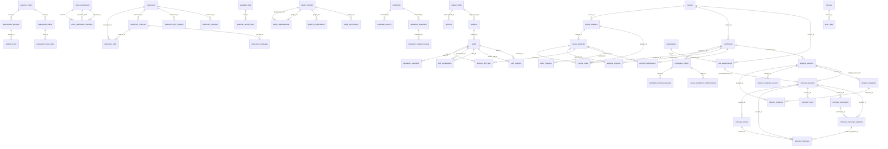

# Database Schema

> Alexandria — SQLite (local-first)

> **Generated** from `src-tauri/src/db/schema.rs` by
> `scripts/db/generate-schema-doc.py`. Do not edit by hand; regenerate, or run
> it with `--check` to see whether this file is stale.

**Engine**: SQLCipher (rusqlite, `bundled-sqlcipher`) — each profile is its own encrypted database, opened with `PRAGMA key`.
**Schema**: one baseline migration, family `alexandria.profile`, epoch 1.
**Objects**: 92 tables, 105 indexes, 1 view, 3 triggers.

---

## How the schema is managed

One migration, `MIGRATION_001_BASELINE`, creates the whole schema. It replaced
a chain of 94 migrations: that chain was replayed into a database, the result
was dumped, the retired tables and columns were removed, and parity was checked
object by object. The runner in `db/mod.rs` still applies migrations
atomically, one transaction each, and records them in `_migrations`; the
baseline is a starting point for future migrations, not a replacement for them.

A database is stamped with its schema family before any normal query runs:

- `PRAGMA application_id` = `162_114_141` — the first four bytes of `sha256("alexandria.profile")`, masked positive. A file carrying any other value was written by something else.
- `PRAGMA user_version` = `1` — the family epoch. A new baseline bumps it; ordinary migrations never do.
- `_schema_identity` — one row naming the family and epoch, so a refusal can say what a file belongs to.

`validate_or_stamp_identity` in `db/mod.rs` stamps an empty file and refuses
everything else that does not match: a file with tables but no stamp (the old
chain), a foreign `application_id`, an epoch ahead of this build, an epoch
behind it, or a header that disagrees with `_schema_identity`. A refusal
never converts or deletes the file. Pre-launch data is disposable, which is
why there is no upgrade path from the old chain.

## Deliberately absent

These tables existed in the old chain and are not created by the baseline.
Each lost the code that gave it authority; `forbidden_tables_are_absent` in
`db/schema_tests.rs` fails if one returns.

- `credential_challenges`
- `credential_challenge_votes`
- `plugin_attestations`
- `plugin_advisories`
- `sentinel_kill_switch`
- `sentinel_weights_blocklist`
- `sentinel_priors`
- `integrity_attestations`
- `onchain_governance_queue`
- `governance_daos`
- `governance_dao_members`
- `governance_proposals`
- `governance_elections`
- `governance_election_nominees`
- `governance_election_votes`
- `governance_proposal_votes`
- `bank_questions`
- `question_bank_versions`
- `opinion_withdrawals`

Columns dropped with them: `local_identity.account_role` (superseded by the
`account_roles` set) and the CIP-68 columns on `reputation_snapshots`
(`policy_id`, `ref_asset_name`, `user_asset_name`, `snapshot_format`,
`snapshot_scope`).

---

## Design principles

- **Deterministic IDs**: most entities use `hex(blake2b_256(parts.join("|")))` rather than generated UUIDs.
- **Singleton identity per profile**: `local_identity` has `CHECK (id = 1)`. Each profile is its own database file, so the singleton is per profile, not per device.
- **No server tables**: the app is profile-based and local-first.
- **External content**: course content, published profiles and evidence bundles live in the iroh content store as BLAKE3-addressed blobs; SQLite holds metadata, references and caches.
- **Text timestamps**: ISO-8601 `TEXT`, for portability and inspection.
- **Canonical source**: exact DDL, defaults, `CHECK` constraints and indexes are in `src-tauri/src/db/schema.rs`. This document is a rendering of it.

---

## Tables by domain

### Identity (1)

#### `local_identity`

- `id` INTEGER PK — Singleton
- `stake_address` TEXT NOT NULL
- `payment_address` TEXT NOT NULL
- `display_name` TEXT
- `bio` TEXT
- `avatar_cid` TEXT
- `mnemonic_enc` BLOB — Encrypted mnemonic (OS keychain preferred, this is fallback)
- `created_at` TEXT NOT NULL default `datetime('now')`
- `updated_at` TEXT NOT NULL default `datetime('now')`
- `profile_hash` TEXT
- `device_id` TEXT
- `x25519_public_key` BLOB
- `username` TEXT
- `visibility` TEXT NOT NULL default `'public'`
- `birthdate` TEXT
- `activation_state` TEXT NOT NULL default `'active'`
- `account_roles` TEXT NOT NULL default `'["learner"]'`

### Guardianship (3)

#### `guardian_activity_rows`

- `link_id` TEXT PK → `guardian_links.id`
- `table_name` TEXT PK
- `entity_id` TEXT PK
- `payload_json` TEXT NOT NULL
- `updated_at` TEXT NOT NULL

#### `guardian_links`

- `id` TEXT PK
- `side` TEXT NOT NULL
- `peer_did` TEXT NOT NULL
- `peer_stake_address` TEXT
- `peer_peer_id` TEXT — libp2p PeerId once known
- `peer_display_name` TEXT
- `shared_key` BLOB NOT NULL — 32-byte AEAD key (profile DB is vault-scoped)
- `status` TEXT NOT NULL
- `guardian_vc_id` TEXT — parent-issued RoleCredential(role='guardian')
- `invite_code_hash` TEXT — guardian side: for retrying Link while pending
- `child_birthdate` TEXT — guardian side only, from sealed payload
- `created_at` TEXT NOT NULL default `datetime('now')`
- `updated_at` TEXT NOT NULL default `datetime('now')`
- `last_sync_at` TEXT

#### `guardian_pending_invites`

- `code_hash` TEXT PK
- `shared_key` BLOB NOT NULL
- `expires_at` TEXT NOT NULL
- `created_at` TEXT NOT NULL default `datetime('now')`

### Taxonomy (6)

#### `skill_prerequisites`

- `skill_id` TEXT PK → `skills.id`
- `prerequisite_id` TEXT PK → `skills.id`

#### `skill_relations`

- `skill_id` TEXT PK → `skills.id`
- `related_skill_id` TEXT PK → `skills.id`
- `relation_type` TEXT NOT NULL default `'related'` — related|complementary|alternative

#### `skills`

- `id` TEXT PK
- `name` TEXT NOT NULL
- `description` TEXT
- `subject_id` TEXT NOT NULL → `subjects.id`
- `bloom_level` TEXT NOT NULL default `'apply'` — remember|understand|apply|analyze|evaluate|create
- `created_at` TEXT NOT NULL default `datetime('now')`
- `updated_at` TEXT NOT NULL default `datetime('now')`
- `synonyms` TEXT

#### `subject_fields`

- `id` TEXT PK
- `name` TEXT NOT NULL
- `description` TEXT
- `created_at` TEXT NOT NULL default `datetime('now')`
- `updated_at` TEXT NOT NULL default `datetime('now')`
- `icon_emoji` TEXT

#### `subjects`

- `id` TEXT PK
- `name` TEXT NOT NULL
- `description` TEXT
- `subject_field_id` TEXT NOT NULL → `subject_fields.id`
- `created_at` TEXT NOT NULL default `datetime('now')`
- `updated_at` TEXT NOT NULL default `datetime('now')`

#### `taxonomy_versions`

- `version` INTEGER PK
- `cid` TEXT NOT NULL — content ID (BLAKE3 hash) of the full taxonomy document
- `previous_cid` TEXT — CID of the previous version
- `ratified_by` TEXT — DAO committee multisig info
- `ratified_at` TEXT
- `signature` TEXT — Ed25519 signature
- `applied_at` TEXT NOT NULL default `datetime('now')`

### Courses and learning (9)

#### `catalog`

- `course_id` TEXT PK
- `title` TEXT NOT NULL
- `description` TEXT
- `author_address` TEXT NOT NULL
- `content_cid` TEXT NOT NULL
- `thumbnail_cid` TEXT
- `tags` TEXT — JSON array
- `skill_ids` TEXT — JSON array of skill IDs
- `version` INTEGER NOT NULL default `1`
- `published_at` TEXT NOT NULL
- `received_at` TEXT NOT NULL default `datetime('now')`
- `pinned` INTEGER default `0`
- `on_chain_tx` TEXT
- `signature` TEXT NOT NULL — Author's signature over the record
- `kind` TEXT NOT NULL default `'course'`

#### `course_chapters`

- `id` TEXT PK
- `course_id` TEXT NOT NULL → `courses.id`
- `title` TEXT NOT NULL
- `description` TEXT
- `position` INTEGER NOT NULL default `0`
- `created_at` TEXT NOT NULL default `datetime('now')`

#### `course_elements`

- `id` TEXT PK
- `chapter_id` TEXT NOT NULL → `course_chapters.id`
- `title` TEXT NOT NULL
- `element_type` TEXT NOT NULL — video|text|quiz|interactive|assessment
- `content_cid` TEXT — content ID (BLAKE3 hash) of element content
- `position` INTEGER NOT NULL default `0`
- `duration_seconds` INTEGER
- `created_at` TEXT NOT NULL default `datetime('now')`
- `content_inline` TEXT
- `plugin_cid` TEXT
- `plugin_version` TEXT
- `plugin_config_cid` TEXT

#### `course_notes`

- `id` TEXT PK
- `enrollment_id` TEXT NOT NULL → `enrollments.id`
- `chapter_id` TEXT → `course_chapters.id`
- `element_id` TEXT → `course_elements.id`
- `content_cid` TEXT — content ID (BLAKE3 hash) of note content
- `preview_text` TEXT
- `video_timestamp_seconds` INTEGER
- `created_at` TEXT NOT NULL default `datetime('now')`
- `updated_at` TEXT NOT NULL default `datetime('now')`

#### `courses`

- `id` TEXT PK — blake2b(author_stake_address + content_cid)
- `title` TEXT NOT NULL
- `description` TEXT
- `author_address` TEXT NOT NULL — Cardano stake address of the author
- `content_cid` TEXT — content ID (BLAKE3 hash) of course content root
- `thumbnail_cid` TEXT
- `tags` TEXT — JSON array
- `skill_ids` TEXT — JSON array of skill IDs
- `version` INTEGER NOT NULL default `1`
- `status` TEXT NOT NULL default `'draft'` — draft|published|archived
- `published_at` TEXT
- `on_chain_tx` TEXT — Cardano tx hash (if registered on-chain)
- `created_at` TEXT NOT NULL default `datetime('now')`
- `updated_at` TEXT NOT NULL default `datetime('now')`
- `author_name` TEXT
- `thumbnail_svg` TEXT
- `kind` TEXT NOT NULL default `'course'`
- `provenance` TEXT
- `course_document_version` INTEGER
- `completion_policy_json` TEXT
- `draft_completion_policy_json` TEXT

#### `element_progress`

- `id` TEXT PK
- `enrollment_id` TEXT NOT NULL → `enrollments.id`
- `element_id` TEXT NOT NULL → `course_elements.id`
- `status` TEXT NOT NULL default `'not_started'` — not_started|in_progress|completed
- `score` REAL — 0.0 to 1.0 for assessments
- `time_spent` INTEGER default `0` — seconds
- `completed_at` TEXT
- `updated_at` TEXT NOT NULL default `datetime('now')`

#### `element_skill_tags`

- `element_id` TEXT PK → `course_elements.id`
- `skill_id` TEXT PK → `skills.id`
- `weight` REAL NOT NULL default `1.0`

#### `enrollments`

- `id` TEXT PK — blake2b(stake_address + course_id)
- `course_id` TEXT NOT NULL → `courses.id`
- `enrolled_at` TEXT NOT NULL default `datetime('now')`
- `completed_at` TEXT
- `status` TEXT NOT NULL default `'active'` — active|completed|dropped
- `updated_at` TEXT NOT NULL default `datetime('now')`
- `course_document_cid` TEXT
- `course_document_version` INTEGER
- `completion_policy_json` TEXT

#### `video_chapters`

- `id` TEXT PK
- `element_id` TEXT NOT NULL → `course_elements.id`
- `title` TEXT NOT NULL
- `start_seconds` INTEGER NOT NULL
- `position` INTEGER NOT NULL default `0`
- `created_at` TEXT NOT NULL default `datetime('now')`

### Assessments (5)

#### `assessment_attempts`

- `id` TEXT PK
- `subject_did` TEXT NOT NULL
- `bank_id` TEXT NOT NULL → `question_banks.id`
- `skill_id` TEXT NOT NULL
- `seed` INTEGER NOT NULL
- `question_ids` TEXT NOT NULL — JSON array of served question ids (in served order)
- `option_orders` TEXT NOT NULL — JSON: per-question shuffled option index order
- `integrity_session_id` TEXT
- `score` REAL
- `passed` INTEGER
- `credential_id` TEXT — issued AssessmentCredential, if passed
- `started_at` TEXT NOT NULL default `datetime('now')`
- `graded_at` TEXT
- `attempt_ordinal` INTEGER
- `ended_at` TEXT
- `end_reason` TEXT
- `draft_answers_json` TEXT

#### `assessment_item_skills`

- `item_id` TEXT PK → `assessment_items.id`
- `skill_id` TEXT PK
- `weight` REAL NOT NULL default `1.0`

#### `assessment_items`

- `id` TEXT PK
- `item_kind` TEXT NOT NULL
- `skill_id` TEXT NOT NULL — Plugin providing the UI and grader. NULL for `mcq`, which resolves the built-in mcq-grader at grade time (it is installed at startup, so its CID is not knowable when this migration runs).
- `plugin_cid` TEXT — Safe to send to a client: prompt, options, kind, starter code.
- `content_public` TEXT NOT NULL — NEVER sent to a client. Answer keys, hidden test cases. Merged into the grade envelope host-side as `content.grader_private`.
- `grader_private` TEXT
- `difficulty` INTEGER NOT NULL default `2` — 1 (easy) .. 5 (hard) Populated in a follow-up once BloomLevel becomes a real enum; orthogonal to difficulty (an easy "create" item is possible).
- `bloom_level` TEXT
- `points` REAL NOT NULL default `1.0` — Provenance: the bank this item came from, when it came from one.
- `bank_id` TEXT → `question_banks.id`
- `author_did` TEXT
- `taxonomy_version` TEXT
- `ratified` INTEGER NOT NULL default `0`
- `created_at` TEXT NOT NULL default `datetime('now')`

#### `attempt_items`

- `attempt_id` TEXT PK → `assessment_attempts.id`
- `ordinal` INTEGER PK — 0-based served order
- `item_id` TEXT NOT NULL
- `option_order` TEXT — JSON: served position -> original index
- `submission_json` TEXT — what the learner submitted
- `grader_cid` TEXT — grader that actually produced `score`
- `content_cid` TEXT
- `submission_cid` TEXT
- `score` REAL — [0,1] for this item
- `score_details` TEXT — grader `details` blob
- `theta_after` REAL
- `se_after` REAL
- `graded_at` TEXT

#### `question_banks`

- `id` TEXT PK
- `skill_id` TEXT NOT NULL
- `label` TEXT NOT NULL
- `pass_threshold` REAL NOT NULL default `0.7` — fraction correct to pass
- `draw_count` INTEGER NOT NULL default `5` — questions per attempt
- `taxonomy_version` TEXT
- `dao_id` TEXT
- `ratified` INTEGER NOT NULL default `0`
- `content_cid` TEXT
- `created_at` TEXT NOT NULL default `datetime('now')`
- `max_attempts` INTEGER
- `cooldown_hours` TEXT NOT NULL default `'[0,24,72,168]'`
- `attempt_window_days` INTEGER NOT NULL default `90`
- `score_policy` TEXT NOT NULL default `'best'`
- `delivery_mode` TEXT NOT NULL default `'fixed'`
- `adaptive_se_target` REAL NOT NULL default `0.3`
- `adaptive_min_items` INTEGER NOT NULL default `5`
- `adaptive_max_items` INTEGER NOT NULL default `20`

### Goals (2)

#### `goal_template_versions`

- `version` INTEGER PK
- `content_cid` TEXT NOT NULL
- `previous_cid` TEXT
- `ratified_by` TEXT — DAO multisig / committee id
- `signature` TEXT
- `taxonomy_version` TEXT
- `published_at` TEXT NOT NULL default `datetime('now')`

#### `goal_templates`

- `id` TEXT PK
- `kind` TEXT NOT NULL
- `key` TEXT NOT NULL — stable slug, e.g. 'cbse.grade10', 'jee_main', 'engineering_manager'
- `label` TEXT NOT NULL — human label, e.g. 'CBSE — Grade 10'
- `board` TEXT — curriculum only: 'CBSE' | 'ICSE' | 'IB' | ...
- `grade` TEXT — curriculum only: '10'
- `skill_ids` TEXT NOT NULL — JSON array of target skill ids
- `taxonomy_version` TEXT — skill-graph version these ids were authored against
- `dao_id` TEXT — ratifying DAO (NULL for genesis-seeded)
- `ratified` INTEGER NOT NULL default `0`
- `content_cid` TEXT — published version doc CID (NULL for genesis)
- `created_at` TEXT NOT NULL default `datetime('now')`
- `updated_at` TEXT NOT NULL default `datetime('now')`

### Community plugins (7)

#### `element_submissions`

- `id` TEXT PK
- `element_id` TEXT NOT NULL → `course_elements.id`
- `enrollment_id` TEXT NOT NULL → `enrollments.id`
- `submission_cid` TEXT NOT NULL — BLAKE3 of the submission bytes (in iroh store)
- `grader_cid` TEXT NOT NULL — BLAKE3 of the grader.wasm
- `content_cid` TEXT NOT NULL — BLAKE3 of the content bytes the grader saw
- `score` REAL NOT NULL
- `score_details_json` TEXT — plugin-defined `details` payload
- `learner_did` TEXT NOT NULL
- `signed_attestation` BLOB — Ed25519 signature over the bundle (NULL until signed)
- `created_at` TEXT NOT NULL default `datetime('now')`
- `grader_version` TEXT NOT NULL default `''`
- `answers_json` TEXT
- `evidence_published` INTEGER NOT NULL default `0`

#### `plugin_catalog`

- `plugin_cid` TEXT PK — BLAKE3 of manifest.json
- `name` TEXT NOT NULL
- `version` TEXT NOT NULL
- `author_did` TEXT NOT NULL
- `description` TEXT
- `api_version` TEXT NOT NULL
- `kinds_json` TEXT NOT NULL — JSON array
- `capabilities_json` TEXT NOT NULL — JSON array
- `subject_tags_json` TEXT NOT NULL — JSON array
- `platforms_json` TEXT NOT NULL — JSON array
- `has_grader` INTEGER NOT NULL default `0`
- `grader_cid` TEXT — NULL for interactive-only
- `source` TEXT NOT NULL — 'gossip' | 'builtin' | 'local'
- `announced_at` TEXT NOT NULL — author-stamped time from announcement
- `last_seen_at` TEXT NOT NULL default `datetime('now')`

#### `plugin_dependencies`

- `plugin_cid` TEXT PK → `plugin_installed.plugin_cid`
- `dependency_id` TEXT PK — manifest id: did:key:<author>#<slug>
- `dependency_cid` TEXT NOT NULL → `plugin_installed.plugin_cid`

#### `plugin_element_state`

- `element_id` TEXT PK
- `plugin_cid` TEXT NOT NULL
- `state_json` TEXT NOT NULL
- `updated_at` TEXT NOT NULL default `datetime('now')`

#### `plugin_installed`

- `plugin_cid` TEXT PK
- `name` TEXT NOT NULL
- `version` TEXT NOT NULL
- `author_did` TEXT NOT NULL
- `install_path` TEXT NOT NULL — filesystem path under app_data/plugins/
- `source` TEXT NOT NULL — 'local_file' | 'p2p' | 'builtin'
- `manifest_json` TEXT NOT NULL — full manifest at install time
- `installed_at` TEXT NOT NULL default `datetime('now')`
- `enabled` INTEGER NOT NULL default `1`

#### `plugin_irl_submissions`

- `id` TEXT PK
- `plugin_cid` TEXT NOT NULL → `plugin_installed.plugin_cid`
- `element_id` TEXT
- `enrollment_id` TEXT
- `learner_did` TEXT NOT NULL
- `submission_json` TEXT NOT NULL
- `skills_json` TEXT NOT NULL default `'[]'`
- `status` TEXT NOT NULL default `'pending'`
- `reviewer_did` TEXT
- `score` REAL
- `feedback` TEXT
- `skill_ratings_json` TEXT
- `created_at` TEXT NOT NULL default `datetime('now')`
- `reviewed_at` TEXT
- `course_id` TEXT

#### `plugin_permissions`

- `plugin_cid` TEXT PK → `plugin_installed.plugin_cid`
- `capability` TEXT PK
- `scope` TEXT NOT NULL
- `granted_at` TEXT NOT NULL default `datetime('now')`
- `granted_until` TEXT — NULL for 'always'

### Verifiable credentials (8)

#### `credential_allowlist`

- `credential_id` TEXT PK
- `requestor_did` TEXT PK — or the literal 'public'
- `granted_at` TEXT NOT NULL default `datetime('now')`

#### `credential_anchors`

- `credential_id` TEXT PK → `credentials.id`
- `anchor_tx_hash` TEXT
- `anchor_status` TEXT NOT NULL default `'pending'` — pending|submitted|confirmed|failed
- `attempts` INTEGER NOT NULL default `0`
- `last_error` TEXT
- `next_attempt_at` TEXT
- `enqueued_at` TEXT NOT NULL default `datetime('now')`
- `confirmed_at` TEXT

#### `credential_status_lists`

- `list_id` TEXT PK — issuer's list identifier
- `issuer_did` TEXT NOT NULL
- `version` INTEGER NOT NULL default `1` — monotonic; older versions ignored
- `status_purpose` TEXT NOT NULL default `'revocation'`
- `bits` BLOB NOT NULL — packed little-endian bitmap
- `bit_length` INTEGER NOT NULL default `0`
- `signature` TEXT — issuer signature over (list_id, version, bits)
- `updated_at` TEXT NOT NULL default `datetime('now')`

#### `credentials`

- `id` TEXT PK — e.g. urn:uuid:...
- `issuer_did` TEXT NOT NULL
- `subject_did` TEXT NOT NULL
- `credential_type` TEXT NOT NULL — FormalCredential, etc.
- `claim_kind` TEXT NOT NULL — skill | role | custom
- `skill_id` TEXT — NULL for non-skill claims
- `issuance_date` TEXT NOT NULL
- `expiration_date` TEXT
- `signed_vc_json` TEXT NOT NULL — full JSON-LD VC
- `integrity_hash` TEXT NOT NULL — hex(blake3(JCS bytes))
- `status_list_id` TEXT — FK to credential_status_lists.list_id
- `status_list_index` INTEGER — bit position in the list
- `revoked` INTEGER NOT NULL default `0` — cached from status list for fast queries
- `revoked_at` TEXT
- `revocation_reason` TEXT
- `supersedes` TEXT — prior credential id, §11.4
- `received_at` TEXT NOT NULL default `datetime('now')`
- `suspended` INTEGER NOT NULL default `0`
- `suspended_at` TEXT
- `suspended_until` TEXT
- `suspended_reason` TEXT
- `witness_tx_hash` TEXT
- `witness_validator_script_hash` TEXT
- `witness_validator_name` TEXT
- `auto_issued` INTEGER NOT NULL default `0`
- `provenance` TEXT

#### `credentials_pending_verification`

- `id` TEXT PK
- `issuer_did` TEXT NOT NULL
- `subject_did` TEXT NOT NULL
- `signed_vc_json` TEXT NOT NULL
- `received_at` TEXT NOT NULL default `datetime('now')`

#### `key_registry`

- `did` TEXT PK
- `key_id` TEXT PK — '<did>#key-N' fragment
- `public_key_hex` TEXT NOT NULL — raw 32-byte Ed25519 pubkey, hex
- `valid_from` TEXT NOT NULL — ISO 8601 UTC
- `valid_until` TEXT — NULL while active
- `rotated_by` TEXT — DID of successor, if rotated

#### `pinboard_observations`

- `id` TEXT PK
- `pinner_did` TEXT NOT NULL
- `subject_did` TEXT NOT NULL
- `scope` TEXT NOT NULL — JSON array of strings
- `commitment_since` TEXT NOT NULL
- `revoked_at` TEXT
- `signature` TEXT NOT NULL
- `public_key` TEXT NOT NULL
- `received_at` TEXT NOT NULL default `datetime('now')`

#### `presentations_seen`

- `audience` TEXT PK
- `nonce` TEXT PK
- `seen_at` TEXT NOT NULL default `datetime('now')`

### Chain journal (2)

#### `chain_submission_members`

- `network` TEXT PK → `chain_submissions.network`
- `member_kind` TEXT PK
- `member_id` TEXT PK
- `operation_kind` TEXT NOT NULL → `chain_submissions.operation_kind`
- `operation_id` TEXT NOT NULL → `chain_submissions.operation_id`

#### `chain_submissions`

- `network` TEXT PK
- `operation_kind` TEXT PK
- `operation_id` TEXT PK
- `tx_hash` TEXT NOT NULL
- `signed_cbor` BLOB NOT NULL
- `context_json` TEXT NOT NULL
- `status` TEXT NOT NULL default `'outcome_unknown'`
- `confirmed_slot` INTEGER
- `applied_at` TEXT
- `last_error` TEXT
- `created_at` TEXT NOT NULL default `datetime('now')`
- `updated_at` TEXT NOT NULL default `datetime('now')`

### Completion and endorsements (4)

#### `completion_claims`

- `id` TEXT PK
- `subject_did` TEXT NOT NULL
- `course_id` TEXT NOT NULL
- `completion_root` TEXT NOT NULL
- `credential_ids_json` TEXT NOT NULL
- `witness_unavailable` INTEGER NOT NULL default `0`
- `created_at` TEXT NOT NULL default `datetime('now')`
- `course_document_cid` TEXT
- `course_document_version` INTEGER
- `completion_binding_json` TEXT
- `enrollment_id` TEXT → `enrollments.id`

#### `completion_observations`

- `policy_id` TEXT PK
- `asset_name_hex` TEXT PK
- `tx_hash` TEXT NOT NULL
- `subject_pubkey` TEXT NOT NULL — hex, 64 chars (32-byte Ed25519 pubkey)
- `course_id` TEXT NOT NULL — hex
- `completion_root` TEXT NOT NULL — hex, 64 chars (32-byte blake2b-256)
- `completion_time` TEXT NOT NULL — ISO 8601 from CompletionDatum.timestamp
- `credential_id` TEXT — populated once the VC is issued
- `observed_at` TEXT NOT NULL default `datetime('now')`
- `issued_at` TEXT

#### `completion_witness_requests`

- `operation_id` TEXT PK
- `claim_id` TEXT NOT NULL → `completion_claims.id`
- `context_json` TEXT NOT NULL
- `blocked` INTEGER NOT NULL default `0`
- `attempts` INTEGER NOT NULL default `0`
- `next_attempt_at` INTEGER NOT NULL default `0`
- `last_error` TEXT
- `created_at` TEXT NOT NULL default `datetime('now')`

#### `course_completion_endorsements`

- `id` TEXT PK
- `claim_id` TEXT NOT NULL → `completion_claims.id`
- `attestor_did` TEXT NOT NULL
- `endorsement_json` TEXT NOT NULL
- `created_at` TEXT NOT NULL default `datetime('now')`

### Opinions (2)

#### `opinions`

- `id` TEXT PK — blake2b(author_address + video_cid)
- `author_address` TEXT NOT NULL — Cardano stake address
- `subject_field_id` TEXT NOT NULL → `subject_fields.id`
- `title` TEXT NOT NULL
- `summary` TEXT — soft limit 280 chars at app layer
- `video_cid` TEXT NOT NULL — iroh BLAKE3 of video blob
- `thumbnail_cid` TEXT
- `duration_seconds` INTEGER
- `credential_proof_ids` TEXT NOT NULL — JSON array of skill_proof IDs the author stakes
- `signature` TEXT NOT NULL — Ed25519 over the canonical payload
- `public_key` TEXT — Ed25519 public key (hex) for verification
- `published_at` TEXT NOT NULL
- `received_at` TEXT NOT NULL default `datetime('now')`
- `withdrawn` INTEGER NOT NULL default `0`
- `withdrawn_reason` TEXT — e.g. 'challenge_upheld'
- `on_chain_tx` TEXT — optional: future DAO-attested anchor
- `provenance` TEXT

#### `opinions_pending_verification`

- `id` TEXT PK
- `author_address` TEXT NOT NULL
- `subject_field_id` TEXT NOT NULL
- `title` TEXT NOT NULL
- `summary` TEXT
- `video_cid` TEXT NOT NULL
- `thumbnail_cid` TEXT
- `duration_seconds` INTEGER
- `credential_proof_ids` TEXT NOT NULL
- `signature` TEXT NOT NULL
- `public_key` TEXT
- `published_at` TEXT NOT NULL
- `queued_at` TEXT NOT NULL default `datetime('now')`

### Reputation (5)

#### `derived_skill_state_history`

- `subject_did` TEXT PK
- `skill_id` TEXT PK
- `snapshot_date` TEXT PK
- `raw_score` REAL NOT NULL
- `confidence` REAL NOT NULL
- `trust_score` REAL NOT NULL
- `level` INTEGER NOT NULL
- `evidence_mass` REAL NOT NULL
- `computed_at` TEXT NOT NULL

#### `derived_skill_states`

- `subject_did` TEXT PK
- `skill_id` TEXT PK
- `calculation_version` TEXT PK
- `raw_score` REAL NOT NULL
- `confidence` REAL NOT NULL
- `trust_score` REAL NOT NULL
- `level` INTEGER NOT NULL
- `evidence_mass` REAL NOT NULL
- `unique_issuer_clusters` INTEGER NOT NULL
- `active_evidence_count` INTEGER NOT NULL
- `state_json` TEXT NOT NULL — full DerivedSkillState
- `computed_at` TEXT NOT NULL
- `dominant_provenance` TEXT
- `input_fingerprint` TEXT

#### `reputation_assertions`

- `id` TEXT PK
- `actor_address` TEXT NOT NULL — Cardano stake address
- `role` TEXT NOT NULL — instructor|learner|assessor|author|mentor
- `skill_id` TEXT → `skills.id`
- `proficiency_level` TEXT
- `score` REAL NOT NULL
- `evidence_count` INTEGER NOT NULL default `0`
- `median_impact` REAL
- `impact_p25` REAL
- `impact_p75` REAL
- `learner_count` INTEGER
- `impact_variance` REAL
- `window_start` TEXT
- `window_end` TEXT
- `computation_spec` TEXT NOT NULL default `'v2'`
- `cid` TEXT — content ID (BLAKE3 hash) of reputation proof
- `updated_at` TEXT NOT NULL default `datetime('now')`
- `input_policy_state` TEXT NOT NULL default `'valid'`
- `input_fingerprint` TEXT

#### `reputation_snapshot_inputs`

- `snapshot_id` TEXT PK → `reputation_snapshots.id`
- `context_json` TEXT NOT NULL

#### `reputation_snapshots`

- `id` TEXT PK
- `actor_address` TEXT NOT NULL
- `subject_id` TEXT NOT NULL
- `role` TEXT NOT NULL
- `skill_count` INTEGER NOT NULL default `0`
- `tx_status` TEXT NOT NULL default `'pending'` — pending|building|submitted|confirmed|failed
- `tx_hash` TEXT
- `error_message` TEXT
- `snapshot_at` TEXT NOT NULL default `datetime('now')`
- `confirmed_at` TEXT
- `computation_spec` TEXT
- `credential_id` TEXT → `credentials.id`

### Integrity (Sentinel) (8)

#### `integrity_evidence`

- `id` TEXT PK
- `session_id` TEXT NOT NULL → `integrity_sessions.id` — The flagged snapshot this evidence belongs to.
- `snapshot_id` TEXT → `integrity_snapshots.id` — camera_frame | keystroke | mouse | gaze
- `kind` TEXT NOT NULL — Opaque payload. Camera frames are stored encoded, not as raw RGBA. The database file is SQLCipher-encrypted at rest under the profile vault key, so this inherits that protection and nothing weaker.
- `payload` BLOB NOT NULL
- `captured_at` TEXT NOT NULL
- `expires_at` TEXT NOT NULL

#### `integrity_evidence_consent`

- `session_id` TEXT PK → `integrity_sessions.id` — 1 = learner chose to preserve, 0 = declined. There is no default: a row exists only because a human answered.
- `granted` INTEGER NOT NULL
- `decided_at` TEXT NOT NULL default `datetime('now')` — NULL when declined. Absolute deadline, not a duration, so a device that is offline for a month still expires the evidence on next open.
- `expires_at` TEXT

#### `integrity_evidence_release`

- `session_id` TEXT PK — The service it went to, as the learner's directory list spells it.
- `directory_url` TEXT PK — Their identifier for the assessment, learned from that person's own export. This device does not otherwise have a name for it.
- `run_id` TEXT PK
- `released_at` TEXT NOT NULL default `datetime('now')`
- `item_count` INTEGER NOT NULL default `0` — Set the moment the learner asks for it back. Cleared never; it is the record that they asked.
- `revoke_wanted_at` TEXT — Set when the service confirmed. Until then the withdrawal is still owed.
- `revoked_at` TEXT

#### `integrity_flag_notice`

- `directory_url` TEXT PK — The service's identifier for the assessment.
- `run_id` TEXT PK — What it was for, kept so the notice can name it without another fetch.
- `organisation` TEXT NOT NULL default `''`
- `role_label` TEXT NOT NULL default `''`
- `first_seen_at` TEXT NOT NULL default `datetime('now')` — When the learner was shown it. NULL means they have not been yet.
- `told_at` TEXT

#### `integrity_sessions`

- `id` TEXT PK
- `enrollment_id` TEXT → `enrollments.id`
- `status` TEXT NOT NULL default `'active'` — active|completed|flagged|suspended
- `integrity_score` REAL
- `started_at` TEXT NOT NULL default `datetime('now')`
- `ended_at` TEXT
- `critical_count` INTEGER NOT NULL default `0`
- `warning_count` INTEGER NOT NULL default `0`
- `assurance_level` TEXT NOT NULL default `'local'`
- `commitment_root` TEXT
- `anchor_ref` TEXT
- `purpose` TEXT NOT NULL default `'assessment'`

#### `integrity_snapshots`

- `id` TEXT PK
- `session_id` TEXT NOT NULL → `integrity_sessions.id`
- `typing_score` REAL
- `mouse_score` REAL
- `human_score` REAL
- `tab_score` REAL
- `paste_score` REAL
- `devtools_score` REAL
- `camera_score` REAL
- `composite_score` REAL
- `captured_at` TEXT NOT NULL default `datetime('now')`
- `anomaly_flags` TEXT
- `ai_paste_anomaly` REAL
- `gaze_offscreen_ratio` REAL
- `commitment_hash` TEXT

#### `sentinel_holdout_refs`

- `id` TEXT PK
- `encrypted_cid` TEXT NOT NULL
- `model_kind` TEXT NOT NULL — 'keystroke' | 'mouse'
- `threshold` INTEGER NOT NULL
- `key_policy` TEXT NOT NULL — JSON: sealed-share envelope
- `created_at` TEXT NOT NULL default `datetime('now')`

#### `sentinel_user_models`

- `user_address` TEXT PK
- `device_fp_prefix` TEXT PK
- `model_kind` TEXT PK
- `weights_json` TEXT NOT NULL
- `train_loss` REAL
- `trained_epochs` INTEGER NOT NULL default `0`
- `training_samples` INTEGER NOT NULL default `0`
- `updated_at` TEXT NOT NULL default `datetime('now')`

### Interviews (6)

#### `interview_criteria`

- `id` TEXT PK
- `session_id` TEXT NOT NULL → `interview_sessions.id`
- `label` TEXT NOT NULL
- `position` INTEGER NOT NULL
- `status` TEXT NOT NULL default `'not_covered'`
- `notes` TEXT

#### `interview_followups`

- `id` TEXT PK
- `session_id` TEXT NOT NULL → `interview_sessions.id`
- `source_segment_id` TEXT → `interview_transcript_segments.id`
- `criterion_id` TEXT → `interview_criteria.id`
- `question` TEXT NOT NULL
- `reason` TEXT NOT NULL
- `status` TEXT NOT NULL default `'suggested'`
- `created_at` TEXT NOT NULL default `datetime('now')`

#### `interview_notes`

- `id` TEXT PK
- `session_id` TEXT NOT NULL → `interview_sessions.id`
- `text` TEXT NOT NULL
- `is_private` INTEGER NOT NULL default `1`
- `created_at` TEXT NOT NULL default `datetime('now')`
- `updated_at` TEXT NOT NULL default `datetime('now')`

#### `interview_participants`

- `id` TEXT PK
- `session_id` TEXT NOT NULL → `interview_sessions.id`
- `peer_id` TEXT
- `display_name` TEXT NOT NULL
- `role` TEXT NOT NULL
- `pseudonym` TEXT NOT NULL
- `consent_transcription` INTEGER NOT NULL default `0`
- `consent_audio_recording` INTEGER NOT NULL default `0`
- `consent_video_recording` INTEGER NOT NULL default `0`
- `consent_sentinel` INTEGER NOT NULL default `0`
- `consent_camera` INTEGER NOT NULL default `0`
- `consented_at` TEXT
- `revoked_at` TEXT
- `created_at` TEXT NOT NULL default `datetime('now')`

#### `interview_sessions`

- `id` TEXT PK
- `title` TEXT NOT NULL
- `objective` TEXT
- `role_assessment_id` TEXT → `role_assessments.id`
- `tutoring_session_id` TEXT
- `status` TEXT NOT NULL default `'draft'`
- `duration_minutes` INTEGER NOT NULL default `45`
- `retention_days` INTEGER NOT NULL default `30`
- `record_audio` INTEGER NOT NULL default `0`
- `record_video` INTEGER NOT NULL default `0`
- `sentinel_enabled` INTEGER NOT NULL default `1`
- `integrity_session_id` TEXT → `integrity_sessions.id`
- `summary` TEXT
- `conclusion` TEXT
- `created_at` TEXT NOT NULL default `datetime('now')`
- `started_at` TEXT
- `ended_at` TEXT
- `expires_at` TEXT NOT NULL

#### `interview_transcript_segments`

- `id` TEXT PK
- `session_id` TEXT NOT NULL → `interview_sessions.id`
- `participant_id` TEXT NOT NULL → `interview_participants.id`
- `speaker_label` TEXT NOT NULL
- `text` TEXT NOT NULL
- `start_ms` INTEGER NOT NULL default `0`
- `end_ms` INTEGER NOT NULL default `0`
- `is_final` INTEGER NOT NULL default `1`
- `confidence` REAL
- `source` TEXT NOT NULL default `'manual'`
- `created_at` TEXT NOT NULL default `datetime('now')`

### Organizations and role assessments (2)

#### `organizations`

- `id` TEXT PK — blake2b(name + owner_address)
- `name` TEXT NOT NULL
- `owner_address` TEXT NOT NULL — sponsor admin stake address
- `did` TEXT — optional org issuer DID
- `created_at` TEXT NOT NULL default `datetime('now')`

#### `role_assessments`

- `id` TEXT PK
- `org_id` TEXT NOT NULL → `organizations.id`
- `role_title` TEXT NOT NULL — e.g. "SRE L4"
- `job_description` TEXT — JD text
- `course_id` TEXT → `courses.id` — backing assessment
- `skill_ids` TEXT — JSON array of required skill ids
- `issuance_policy_json` TEXT — serialized IssuancePolicy (P0)
- `required_assurance_level` TEXT — local|anchored|high_assurance
- `status` TEXT NOT NULL default `'draft'` — draft|published|archived
- `created_at` TEXT NOT NULL default `datetime('now')`
- `updated_at` TEXT NOT NULL default `datetime('now')`

### Classrooms and tutoring (8)

#### `classroom_calls`

- `id` TEXT PK
- `classroom_id` TEXT NOT NULL → `classrooms.id`
- `channel_id` TEXT → `classroom_channels.id`
- `title` TEXT NOT NULL
- `ticket` TEXT
- `started_by` TEXT NOT NULL
- `status` TEXT NOT NULL default `'active'`
- `started_at` TEXT NOT NULL default `datetime('now')`
- `ended_at` TEXT

#### `classroom_channels`

- `id` TEXT PK — blake2b(classroom_id + name)
- `classroom_id` TEXT NOT NULL → `classrooms.id`
- `name` TEXT NOT NULL
- `description` TEXT
- `channel_type` TEXT NOT NULL default `'text'`
- `position` INTEGER NOT NULL default `0`
- `created_at` TEXT NOT NULL default `datetime('now')`

#### `classroom_group_keys`

- `classroom_id` TEXT PK
- `group_key_enc` BLOB NOT NULL
- `key_version` INTEGER NOT NULL default `1`
- `updated_at` TEXT NOT NULL default `datetime('now')`

#### `classroom_join_requests`

- `id` TEXT PK
- `classroom_id` TEXT NOT NULL → `classrooms.id`
- `stake_address` TEXT NOT NULL
- `display_name` TEXT
- `message` TEXT
- `status` TEXT NOT NULL default `'pending'`
- `reviewed_by` TEXT
- `requested_at` TEXT NOT NULL default `datetime('now')`
- `reviewed_at` TEXT

#### `classroom_members`

- `classroom_id` TEXT PK → `classrooms.id`
- `stake_address` TEXT PK
- `role` TEXT NOT NULL default `'member'`
- `display_name` TEXT
- `joined_at` TEXT NOT NULL default `datetime('now')`
- `x25519_public_key` BLOB

#### `classroom_messages`

- `id` TEXT PK
- `channel_id` TEXT NOT NULL → `classroom_channels.id`
- `classroom_id` TEXT NOT NULL
- `sender_address` TEXT NOT NULL
- `sender_name` TEXT
- `content` TEXT NOT NULL
- `edited_at` TEXT
- `deleted` INTEGER NOT NULL default `0`
- `sent_at` TEXT NOT NULL
- `received_at` TEXT NOT NULL default `datetime('now')`

#### `classrooms`

- `id` TEXT PK — blake2b(owner_address + name + created_at_ms)
- `name` TEXT NOT NULL
- `description` TEXT
- `icon_emoji` TEXT
- `owner_address` TEXT NOT NULL — Cardano stake address (bech32)
- `invite_code` TEXT — 8-char alphanumeric join code (optional)
- `status` TEXT NOT NULL default `'active'`
- `created_at` TEXT NOT NULL default `datetime('now')`
- `updated_at` TEXT NOT NULL default `datetime('now')`

#### `tutoring_sessions`

- `id` TEXT PK
- `title` TEXT NOT NULL
- `ticket` TEXT
- `status` TEXT NOT NULL default `'active'`
- `created_at` TEXT NOT NULL default `datetime('now')`
- `ended_at` TEXT

### Genesis trust (1)

#### `governance_genesis_trust_anchors`

- `dao_id` TEXT PK
- `genesis_hash` TEXT NOT NULL
- `genesis_json` BLOB NOT NULL
- `name` TEXT NOT NULL
- `scope_type` TEXT NOT NULL
- `scope_id` TEXT NOT NULL
- `rules_hash` TEXT NOT NULL
- `pinned_at` TEXT NOT NULL default `datetime('now')`

### P2P, content and sync (12)

#### `content_mappings`

- `external_id` TEXT PK
- `blake3_hash` TEXT NOT NULL
- `size_bytes` INTEGER
- `mapped_at` TEXT NOT NULL default `datetime('now')`

#### `devices`

- `id` TEXT PK — Random UUID per device
- `device_name` TEXT — User-assigned label
- `platform` TEXT — macos|windows|linux
- `first_seen` TEXT NOT NULL default `datetime('now')`
- `last_synced` TEXT
- `is_local` INTEGER NOT NULL default `0` — 1 = this device
- `peer_id` TEXT — libp2p PeerId (if known)
- `stake_address` TEXT
- `shared_key` BLOB
- `paired` INTEGER NOT NULL default `0`

#### `dht_records`

- `key` BLOB PK
- `value` BLOB NOT NULL
- `updated_at` TEXT NOT NULL default `datetime('now')`

#### `peer_profiles`

- `did` TEXT PK
- `username` TEXT
- `display_name` TEXT
- `bio` TEXT
- `avatar_cid` TEXT
- `visibility` TEXT NOT NULL default `'public'`
- `updated_at` TEXT NOT NULL default `datetime('now')`

#### `peers`

- `peer_id` TEXT PK — libp2p PeerId
- `stake_address` TEXT — Cardano stake address (if known)
- `display_name` TEXT
- `last_seen` TEXT NOT NULL
- `addresses` TEXT NOT NULL — JSON array of multiaddrs
- `roles` TEXT — JSON array: ["instructor", "learner"]
- `reputation` REAL

#### `pending_pairings`

- `code_hash` TEXT PK — BLAKE2b hash of the pairing code
- `shared_key` BLOB NOT NULL — 32-byte key offered to the acceptor
- `created_at` TEXT NOT NULL default `datetime('now')`
- `expires_at` TEXT NOT NULL

#### `pins`

- `cid` TEXT PK
- `pin_type` TEXT NOT NULL — course|evidence|profile|taxonomy
- `size_bytes` INTEGER
- `last_accessed` TEXT
- `auto_unpin` INTEGER default `0` — 1 = ok to unpin under storage pressure
- `pinned_at` TEXT NOT NULL default `datetime('now')`

#### `stake_pubkey_registry`

- `stake_address` TEXT PK — Cardano stake addr (bech32)
- `public_key_hex` TEXT PK — Ed25519 libp2p pubkey, lowercase hex
- `valid_from` INTEGER PK — unix secs
- `valid_until` INTEGER — unix secs, NULL = open-ended
- `source` TEXT NOT NULL
- `on_chain_tx` TEXT — tx hash, NULL for snapshot-only
- `snapshot_sig` TEXT — multisig hex, NULL for chain rows
- `last_verified` INTEGER NOT NULL default `0` — unix secs of last chain re-check

#### `sync_log`

- `id` INTEGER PK
- `entity_type` TEXT NOT NULL — evidence|catalog|taxonomy|governance
- `entity_id` TEXT NOT NULL
- `direction` TEXT NOT NULL — sent|received
- `peer_id` TEXT — Which peer (null = broadcast)
- `signature` TEXT
- `synced_at` TEXT NOT NULL default `datetime('now')`

#### `sync_queue`

- `id` INTEGER PK
- `table_name` TEXT NOT NULL
- `row_id` TEXT NOT NULL — PK of the changed row
- `operation` TEXT NOT NULL — insert|update|delete
- `row_data` TEXT — JSON snapshot of the row (null for delete)
- `updated_at` TEXT NOT NULL — Timestamp of the change (LWW tiebreaker)
- `queued_at` TEXT NOT NULL default `datetime('now')`
- `delivered_to` TEXT default `'[]'` — JSON array of device_ids that received it

#### `sync_state`

- `device_id` TEXT PK → `devices.id`
- `table_name` TEXT PK — enrollments|element_progress|course_notes|evidence_records|skill_proof_evidence
- `last_synced_at` TEXT NOT NULL — ISO 8601 timestamp of last sync
- `row_count` INTEGER NOT NULL default `0` — Number of rows synced

#### `username_claims`

- `username` TEXT PK
- `did` TEXT NOT NULL
- `claimed_at` INTEGER NOT NULL
- `tier` INTEGER NOT NULL default `0` — 0 bare | 1 receipted | 2 anchored
- `claim_json` TEXT NOT NULL — full UsernameClaim
- `updated_at` TEXT NOT NULL default `datetime('now')`
- `anchor_verified` INTEGER NOT NULL default `0`

### Settings (1)

#### `app_settings`

- `key` TEXT PK
- `value` TEXT NOT NULL
- `updated_at` TEXT NOT NULL default `datetime('now')`
- `scope` TEXT NOT NULL default `'sync'`

---

## View and triggers

**`current_reputation_assertions`**

```sql
CREATE VIEW current_reputation_assertions AS
SELECT * FROM reputation_assertions WHERE input_policy_state = 'valid';
```

Triggers: `completion_request_existing_journal`, `completion_request_journal_handoff`, `snapshot_submission_checkpoint`.

---

## Entity relationships

Every foreign key in the baseline, parent to child.


```mermaid
erDiagram
    question_banks ||--o{ assessment_attempts : bank_id
    assessment_items ||--o{ assessment_item_skills : item_id
    question_banks ||--o{ assessment_items : bank_id
    assessment_attempts ||--o{ attempt_items : attempt_id
    chain_submissions ||--o{ chain_submission_members : network
    chain_submissions ||--o{ chain_submission_members : operation_kind
    chain_submissions ||--o{ chain_submission_members : operation_id
    classroom_channels ||--o{ classroom_calls : channel_id
    classrooms ||--o{ classroom_calls : classroom_id
    classrooms ||--o{ classroom_channels : classroom_id
    classrooms ||--o{ classroom_join_requests : classroom_id
    classrooms ||--o{ classroom_members : classroom_id
    classroom_channels ||--o{ classroom_messages : channel_id
    enrollments ||--o{ completion_claims : enrollment_id
    completion_claims ||--o{ completion_witness_requests : claim_id
    courses ||--o{ course_chapters : course_id
    completion_claims ||--o{ course_completion_endorsements : claim_id
    course_chapters ||--o{ course_elements : chapter_id
    course_elements ||--o{ course_notes : element_id
    course_chapters ||--o{ course_notes : chapter_id
    enrollments ||--o{ course_notes : enrollment_id
    credentials ||--o{ credential_anchors : credential_id
    course_elements ||--o{ element_progress : element_id
    enrollments ||--o{ element_progress : enrollment_id
    skills ||--o{ element_skill_tags : skill_id
    course_elements ||--o{ element_skill_tags : element_id
    enrollments ||--o{ element_submissions : enrollment_id
    course_elements ||--o{ element_submissions : element_id
    courses ||--o{ enrollments : course_id
    guardian_links ||--o{ guardian_activity_rows : link_id
    integrity_snapshots ||--o{ integrity_evidence : snapshot_id
    integrity_sessions ||--o{ integrity_evidence : session_id
    integrity_sessions ||--o{ integrity_evidence_consent : session_id
    enrollments ||--o{ integrity_sessions : enrollment_id
    integrity_sessions ||--o{ integrity_snapshots : session_id
    interview_sessions ||--o{ interview_criteria : session_id
    interview_criteria ||--o{ interview_followups : criterion_id
    interview_transcript_segments ||--o{ interview_followups : source_segment_id
    interview_sessions ||--o{ interview_followups : session_id
    interview_sessions ||--o{ interview_notes : session_id
    interview_sessions ||--o{ interview_participants : session_id
    integrity_sessions ||--o{ interview_sessions : integrity_session_id
    role_assessments ||--o{ interview_sessions : role_assessment_id
    interview_participants ||--o{ interview_transcript_segments : participant_id
    interview_sessions ||--o{ interview_transcript_segments : session_id
    subject_fields ||--o{ opinions : subject_field_id
    plugin_installed ||--o{ plugin_dependencies : dependency_cid
    plugin_installed ||--o{ plugin_dependencies : plugin_cid
    plugin_installed ||--o{ plugin_irl_submissions : plugin_cid
    plugin_installed ||--o{ plugin_permissions : plugin_cid
    skills ||--o{ reputation_assertions : skill_id
    reputation_snapshots ||--o{ reputation_snapshot_inputs : snapshot_id
    credentials ||--o{ reputation_snapshots : credential_id
    courses ||--o{ role_assessments : course_id
    organizations ||--o{ role_assessments : org_id
    skills ||--o{ skill_prerequisites : prerequisite_id
    skills ||--o{ skill_prerequisites : skill_id
    skills ||--o{ skill_relations : related_skill_id
    skills ||--o{ skill_relations : skill_id
    subjects ||--o{ skills : subject_id
    subject_fields ||--o{ subjects : subject_field_id
    devices ||--o{ sync_state : device_id
    course_elements ||--o{ video_chapters : element_id
```
