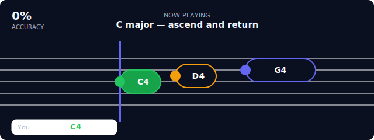

# Music Reviews

A scrolling-timeline ear-training and pitch-accuracy plugin. A sequence of
target notes flows right-to-left toward a fixed hit line while the plugin
listens through the microphone, marking each note correct or wrong using
live pitch detection.



## How it works

1. The plugin renders the target sequence as a horizontal timeline. Each
   note is a pill whose **width is proportional to its duration in beats**;
   the pill's left edge (the note head) is where it must be played.
2. On **Start**, the plugin requests microphone access (once granted, it
   isn't asked again for the session) and runs a 3-beat count-in.
3. The timeline scrolls at the configured tempo. Notes travel toward the
   vertical **hit line**; the note currently at the line is "active".
4. A real-time autocorrelation pitch detector runs over the audio stream.
   Detected pitch is converted to a fractional MIDI value and compared to
   the active note's target.
5. While the learner holds the correct pitch (within `tolerance_cents`),
   a green progress fill grows across the note pill. Once they've held it
   for `holdFraction` of the note's duration, the note locks **correct**.
6. If the note's window closes before enough sustained hold, it locks
   **wrong** (red). Each evaluated note shows what was actually played
   (green/red pill) plus cents-off.
7. At the end the plugin shows a per-note results card, the overall
   accuracy score and best streak, and calls `alex.complete(1, score)`.
   Tempo can be adjusted live with the BPM control; **Pause**, **Restart**,
   and **Finish** (score early) are available.

## Live feedback

- **You** — the pitch the mic is currently hearing, mapped to the nearest
  note name. Dim when confidence is below the accept threshold.
- **Tuning needle** — cents off from the active target. Green inside
  tolerance, amber near, red far.
- **Mic level** — raw input meter with a state label
  (`off` / `silent` / `no pitch` / `weak (clarity N%)` / `locked (clarity N%)`).
  Confirms the mic is capturing even before a clean pitch is detected.

## Configuration

The host passes config via the element's `content` payload. Notes may be
plain strings (one beat each) or objects with an explicit `duration` in
beats:

```json
{
  "title": "C major — ascend and return",
  "notes": [
    { "name": "C4", "duration": 1 },
    { "name": "D4", "duration": 1 },
    { "name": "G4", "duration": 2 },
    "A4",
    { "name": "C4", "duration": 4 }
  ],
  "tolerance_cents": 45,
  "bpm": 60
}
```

| Field | Default | Meaning |
|-------|---------|---------|
| `title` | "Warm-up scale" | Shown in the "Now playing" header |
| `notes` | C-major scale | String (`"C4"`, 1 beat) or `{ name, duration }` |
| `tolerance_cents` | 45 | Max cents off the target that still counts as on-pitch |
| `bpm` | 60 | Scroll tempo; adjustable live by the learner |

Any omitted field uses its default.

## Capabilities

- `microphone` — required. Audio is processed entirely inside the
  sandboxed iframe; pitch detection is local.

## Theming

The plugin consumes the host's theme tokens (`--theme-background`,
`--theme-accent`, `--theme-success`, etc.) supplied at init, so it matches
the user's Light / Dark / custom-accent theme. Defaults are used only if
the host hasn't applied a theme.

## Privacy

The audio stream never leaves the iframe and is never persisted. Only the
final per-note result list (correct/wrong + cents-off) is included in the
completion event.

## Testing

Pitch detection + note utilities live in `ui/pitch.js` (a plain ES module)
so they can be unit-tested headlessly. `ui/pitch.test.js` (vitest)
synthesizes sine tones at known frequencies and asserts the detector picks
the correct semitone within tolerance across a C2–C6 chromatic sweep, plus
silence/noise rejection and fundamental-vs-octave robustness. Run with
`npm test` from the app root.
